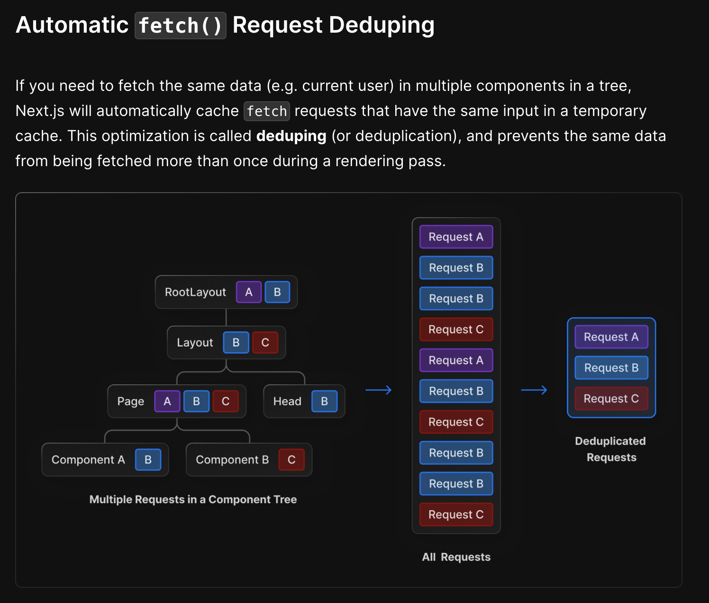

# 11. Next.js 13과 리액트 18

**Next.js 13의 변화된 다양한 사항들을 확인해보자**

## 11.1 app 디렉토리의 등장

### ✨ Next.js의 아쉬운 점으로 손꼽히던 레이아웃 문제의 해결

- 기존 React 앱은 `<Route>`와 `<Outlet>` 등을 통해 레이아웃을 관리 가능했지만, Next.js의 경우 12버전까진 공통 레이아웃을 유지하는 방법은 `_app` 파일이 유일했다.

<br>

### 11.1.1 라우팅

---

### 🔖 기존의 페이지 라우팅 방식에서 앱 라우팅 방식으로 변경되었고, 파일명으로 라우팅하는 것이 불가능해졌다.

- Next.js 13버전부터 디렉토리 내부의 파일명은 라우팅 명칭에 영향을 끼칠 수 없다.

```bash
# 12
pages/a/b.tsx or pages/a/b/index.tsx -> 동일

# 13
pages/a/b -> a/b로 변환, 파일명 무시
```

- 폴더명으로 라우팅하며 바뀐 점 중 하나가 바로 폴더에 포함될 수 있는 파일명이다.

### 예를 들어 `layout.js`가 있으며, 이는 페이지의 기본적인 레이아웃을 구성한다.

```jsx
import "./globals.css";

export default function RootLayout({ children }) {
  return (
    <html lang="en">
      <head>
        <title>My Next.js App</title>
      </head>
      <body>
        <header>
          <nav>
            <ul>
              <li>
                <a href="/">Home</a>
              </li>
              <li>
                <a href="/about">About</a>
              </li>
              <li>
                <a href="/contact">Contact</a>
              </li>
            </ul>
          </nav>
        </header>
        <main>{children}</main> {/**App 디렉토리 안의 컴포넌트들이 들어갈 곳**/}
        <footer>
          <p>© 2023 My Next.js App</p>
        </footer>
      </body>
    </html>
  );
}
```

- 이는 `_app`, `_document` 파일을 대체할 새로운 시작점으로 사용될 수 있다.

- 추가적으로 페이지 하위에 적용하는 `layout.js` 파일의 경우 해당 페이지에서만 적용된다.

<br>

### 또다른 예약어로 `page.js`가 있다.

```js
export default function MainPage() {
  return <>페이지</>;
}
```

- 앞서 구성한 `layout.js`를 기반으로 컴포넌트를 노출한다.

  params: 옵셔널 값이며 동적 라우트 파라미터 사용 시 해당 파라미터에 값이 들어온다.

  searchPrams: `URLSearchParams` 를 의미한다. 이 값은 `layout` 에서는 제공되지 않으며 무조건 `page` 내부에서 수행해야 한다.

<br>

### `error.js` 도 있다!

- 해당하는 라우팅 영역에서 사용되는 공통 컴포넌트로서 에러 UI를 커스텀 및 렌더링한다.

### 🚫 추가적으로 `layout` 에서 에러가 발생하는 경우, `error.js`를 감싸주는 컴포넌트기 때문에 해당 에러 페이지가 렌더링 되지 않는다.

<br>

### `not-found.js`도!

- 특정 라우팅 하위 주소를 찾을 수 없는 404 페이지 렌더링 시 사용된다.

### `loading.js`!

- 후술할 리액트 Suspense를 기반으로 컴포넌트를 불러오는 도중에 사용된다.

### `route.js`는 중요하다

- 앱 라우팅 방식이 정식으로 출시되며 내부의 pages/api의 지원 또한 추가되었다.

- 해당 파일 내에서 REST API의 메서드명을 예약어로 선언하면 해당 메서드에 맞게 요청을 보내는 형식으로 작동한다.

```js
// 동적으로 파라미터를 받는경우
export async function GET(request: NextRequest, context: { params: { id: string } }) {
  const res = await fetch(`http...`);

  return new Response(JSON.stringfy(result), {
    status: 200,
    headers: {
      "Content-Type": "applictaion/json",
    },
  });
}
```

- `request` : `fetch`의 `req`를 확장한 Next.js만의 고유 개념이며, `cookie`, `header`, `nextUrl` 같은 주소도 확인 가능하다.

- `context` : `params`만을 가지고 있는 객체이며 동적 파라미터 객체를 포함한다.

<br>

## 11.2 리액트 서버 컴포넌트

### ✨ 서버 사이드 렌더링과 완전히 다른 개념

<br>

### 11.2.1 기존 리액트 컴포넌트와 서버 사이드 렌더링의 한계

---

### 🔖 리액트와 Next.js의 CSR과 SSR은 정말 좋은 로직이나, 한계도 존재한다.

- 자바스크립트 번들 크기가 0인 컴포넌트를 만들 수 없다. -> 이는 결국 다양한 라이브러리를 사용 시 사용자가 그만큼 부담을 가지게 된다는 것을 의미한다.

- 백엔드 리소스에 대한 직접 접근이 불가하다. -> 클라이언트에서 직접 백엔드에 접근해 원하는 데이터를 가져올 수 없다.

- 자동 코드 분할이 불가능하다. -> 코드를 여러 작은 단위로 나누어 필요할 때만 동적으로 지연 로딩시켜 최적화를 기대하는 방식을 사용할 수 없다.

- 연쇄적으로 발생하는 클라이언트와 서버의 요청을 대응하기 어렵다. -> 부모 컴포넌트의 요청과 렌더링 결정 전까지, 해당 컴포넌트의 하위들은 기다려야한다.

- 추상화에 드는 비용이 증가한다. -> 리액트는 템플릿 언어로 설계되지 않아 추상화가 복잡해질수록 코드양이 많아지고 런타임 시 오버헤드가 발생한다.

### ✅ 결국 각자 장단점이 존재하기 때문에 두마리 토끼를 다 잡으려고 노력한 것이 서버 컴포넌트라고 할 수 있다.

<br>

### 11.2.2 서버 컴포넌트란?

---

### 🔖 하나의 언어, 프레임워크, API와 개념을 통해 서버와 클라이언트 모두가 컴포넌트를 렌더링하는 기법

- 각자 할 수 없는 역할을 분배하여 서버와 클라이언트 모두가 협동하는 방식이다.


- `ReactNode`를 통해 서버 컴포넌트는 클라이언트 컴포넌트가 될 수도 있고, 반대의 경우 또한 가능하다.

| 컴포넌트            | 설명                                                                                                                                                                                                                                  |
| ------------------- | ------------------------------------------------------------------------------------------------------------------------------------------------------------------------------------------------------------------------------------- |
| 서버 컴포넌트       | 서버에서 실행되므로 상태를 가질 수 없음, 렌더링 생명주기(`useEffect` 등) 사용 불가, 사용자 정의 훅 사용 불가, DOM API 사용 및 접근 불가, 서버에 있는 데이터에 async/await으로 접근 가능, HTML 요소 및 클라이언트 컴포넌트 렌더링 가능 |
| 클라이언트 컴포넌트 | 서버 컴포넌트를 불러오거나 서버전용 훅, 유틸리티 사용 불가, 서버 컴포넌트가 자식인 경우 등 중첩 구조로 설계하는 방식은 가능, 이를 제외하면 리액트 컴포넌트와 흡사                                                                     |
| 공용 컴포넌트       | 서버 및 클라이언트 모두 사용 가능                                                                                                                                                                                                     |

### 리액트는 셋다 공용 컴포넌트로 분류하며, 명시적으로 선언(use client)하여 구분한다.

- 서버 컴포넌트 개발 과정이 매우 험난했음을 이를 통해 느낄 수 있다.

<br>

### 11.2.3 서버 사이드 렌더링과 서버 컴포넌트의 차이

---

### 🔖 SSR과 서버 컴포넌트는 완전히 다른 개념이다.

- SSR : 응답받은 페이지를 HTML로 렌더링하는 과정을 서버에서 진행한 후 결과를 클라이언트로 전송, 이를 받아 하이드레이션을 진행

- 따라서 SSR과 서버 컴포넌트를 모두 채택하는 것도 가능해질 것이며, 상호보완의 개념으로 보는 것이 옳다.

<br>

### 11.2.4 서버 컴포넌트는 어떻게 작동하는가?

---

### 🔖 서버 컴포넌트는 SSR과는 아예 다르게 작동한다.

- 서버가 렌더링 요청을 받는다. 이 때 서버 컴포넌트를 사용하는 모든 페이지는 항상 서버에서 시작하며, 이에 따라 루트 컴포넌트는 항상 서버 컴포넌트이다.

- 서버는 받은 요청을 JSON으로 직렬화하며, 서버가 렌더링할 수 있는 것만 해당하고 클라이언트 사이드는 플레이스홀더 방식으로 비워둔다.

- 브라우저가 리액트 컴포넌트 트리 구성, 상황에 따른 결과물을 기반으로 트리를 재구성하여 최종적으로 브라우저의 DOM에 커밋한다.

### 🏷️ 작동 방식의 특이점

- 스트리밍 형태로 전송하여 클라이언트가 줄 단위로 JSON을 읽고 빠르게 사용자에게 결과물을 보여준다.

- 각 컴포넌트별로 번들링이 별개로 되어 있어 필요에 따른 컴포넌트 작업이 가능하다.

- 단순히 HTML을 그리는 작업이 아닌 서버와 클라이언트의 조화를 추구하는 작업이므로 JSON을 사용한 것도 눈여겨볼만 하다.

<br>

## 11.3 Next.js에서의 리액트 서버 컴포넌트

### ✨ 리액트와 거의 동일하나, 몇가지 차이점이 존재한다.

<br>

### 11.3.1 새로운 fetch 도입과 getServerSideProps, getStaticProps, getInitialProps의 삭제

---

### 🔖 app 디렉토리 내부에서 모든 데이터 요청은 fetch를 통해 이루어진다.

```jsx
async function getData() {
  const result = await fetch('http://...');

  if(!result.ok){
    throw new Error('데이터 불러오기 실패');
  }

  return result.json()
}

export default async function Page(){
  const data = await getData();

  return (
    <main>
      <Children data={data}>
    </main>
  )
}
```

- 서버에서 직접 데이터를 불러오며, 컴포넌트 자체가 비동기적으로 작동하는 것 또한 가능해진다.



- SWR이나 리액트 쿼리와 비슷하게 서버에서 fetch 요청 내용을 캐싱하여 렌더링 전까지 유지하며 중복 요청을 방지한다.

<br>

### 11.3.2 정적 렌더링과 동적 렌더링

---

### 🔖 정적 라우팅의 경우 빌드 타임에 미리 렌더링, 캐싱해 재사용하며 동적 라우팅은 서버에 요청에 올 때마다 컴포넌트를 렌더링한다.

```jsx
// app/contact/page.js
import React from "react";

// 서버 측 데이터 패칭 함수
async function fetchData() {
  const res = await fetch("http://localhost:3000/api/getData");
  // or
  const res = await fetch("http://localhost:3000/api/getData", { cache: "no-cache" });
  const data = await res.json();
  return data;
}

const ContactPage = async () => {
  const data = await fetchData();

  return (
    <div>
      <h1>Contact Us</h1>
      <p>Get in touch with us through this page.</p>
      <div>
        <h2>Data from API:</h2>
        <pre>{JSON.stringify(data, null, 2)}</pre>
      </div>
    </div>
  );
};

export default ContactPage;
```

- 위와 같이 캐싱 여부를 결정하고 fetch 요청 로직을 작성할 수 있다.

- 또한 캐싱 여부를 작성하지 않더라도 헤더나 쿠키 정보를 불러오는 함수를 사용하면 동적 연산을 바탕으로 결과를 반환하는 것으로 판단해 정적 렌더링을 하지 않는다.

```jsx
// app/products/[id]/page.js
import { useRouter } from "next/router";
import React from "react";

export async function generateStaticParams() {
  return [{ id: "1" }, { id: "2" }, { id: "3" }];
}

async function fetchData(params: { id: string }) {
  const res = await fetch("https://api.example.com/products");
  const data = await res.json();
  return data;
}

export default async function Page({
  params,
}: {
  params: {id: string}
  children?:React.ReactNode
}){
  const data = await fetchData(params)

  return (
    <div>
      <h1>{data.title}</h1>
    </div>
  )
}
```

- 또한 위 코드처럼 `getStaticProps`의 방식을 흉내내어 사용하는 것 또한 가능하다.

- 옵션에 따라 다양한 작동방식을 사용할 수 있다. `ex) fetch(URL, { cache: 'force-cache'})`

<br>

### 11.3.3 캐시와 mutating, revalidating

---

### 🔖 데이터의 유효시간을 정해두고 그에 따라 데이터를 불러와 페이지를 렌더링한다.

```jsx
export const revalidate = 60;
```

- 최초 라우트 요청 시 정적으로 캐시해둔 데이터를 보여준다.

- 캐시된 요청은 `revalidate`에 선언된 값만큼 유지, 해당 시간이 지나도 일단 캐시된 데이터를 보여준다.

- 캐시된 데이터를 보여주는 와중에 백그라운드에서 다시 데이터를 불러온다

- 데이터 불러오기에 성공하면 캐시 데이터를 갱신하고, 실패 시 기존 데이터를 그대로 보여준다.

<br>

### 11.3.4 스트리밍을 활용한 점진적인 페이지 불러오기

---

### 🔖 HTML이 다 완성되고 나서가 아닌 점진적으로 쪼개 완성될 때마다 조금씩 보내는 기법이다.

- 컴포넌트가 완성되는대로 클라이언트에 내려준다면 사용자는 페이지가 완성될 때까지 기다리는 지루함을 덜고, 로딩중이라는 인식을 정확히 심을 수 있다.

- `loading.tsx`와 Suspense 배치를 통해 스트리밍을 활용할 수 있다.

<br>

## 11.4 웹팩의 대항마, 터보팩의 등장

### ✨ 러스트 기반 작성 툴로, 웹팩의 후계자를 자처하고 있다.

- 아직은 애기지만 주목해보자

<br>

## 11.5 서버 액션

### ✨ API를 생성하지 않고 함수에서 서버에 직접 접근해 데이터 요청 등을 수행하는 기능이다.

- 먼저 `next.config.js`에서 해당 기능을 활성화한다.

```js
const nextConfig = {
  experimental: {
    serverActions: true,
  },
};
```

- 'use client' 처럼 'use server'를 선언해야 한다.

<br>

### 11.5.1 form의 action

---

### 🔖 서버 액션으로 form.action 함수를 만들 수 있다.

```jsx
export default function Page() {
  async function handleSubmit () {
    'use server'

    const res = await fetch('http://.../post', {
      method: 'post',
      body: JSON.stringfy({
        ...
      }),
      headers: {
        'Content-Type': 'application/json; charset=UTF-8'
      }
    })

    const result = await res.json()
  }

  return (
    <form action={handleSubmit}>
      <button type="submit">요청 보내기</button>
    </form>
  )
}
```

- 위와 같이 서버 액션 함수를 만들어 서버가 함수를 수행할 수 있도록 구현했다.

- 핵심은 'use server'로, 번들링에 포함시키지 않고 서버에서 이를 실행하도록 만들어 효율성을 높혔다.

- 또한 폼과 실제 노출 데이터가 연동되어 있을 경우 더욱 큰 시너지를 발휘한다.

- 추가적으로 다양한 메서드를 사용하여 (`redirect`, `revalidatePath` 등) 자연스러운 사용자 경험을 유도할 수 있다.

<br>

### 11.5.2 input의 submut과 iamge의 formAction

---

### 🔖 form과 마찬가지로 input도 서버 액션을 추가 가능하다.

<br>

### 11.5.3 startTransition과의 연동

---

### 🔖 `useTranstion`에서 제공하는 `startTranstion`에서도 서버 액션을 사용할 수 있다.

```jsx
"use client"; // 이 페이지는 클라이언트 컴포넌트로 동작합니다.
import React, { useState, useTransition } from "react";

export default function FormPage() {
  const [isPending, startTransition] = useTransition();
  const [name, setName] = useState("");
  const [email, setEmail] = useState("");
  const [message, setMessage] = useState("");
  const [response, setResponse] = useState(null);

  const handleSubmit = async (event) => {
    event.preventDefault();

    startTransition(async () => {
      const res = await fetch("/api/form-action", {
        method: "POST",
        headers: {
          "Content-Type": "application/json",
        },
        body: JSON.stringify({ name, email, message }),
      });

      const data = await res.json();
      setResponse(data);
    });
  };

  return (
    <div>
      <h1>Contact Us</h1>
      <form onSubmit={handleSubmit}>
        <div>
          <label>
            Name:
            <input type="text" value={name} onChange={(e) => setName(e.target.value)} required />
          </label>
        </div>
        <div>
          <label>
            Email:
            <input type="email" value={email} onChange={(e) => setEmail(e.target.value)} required />
          </label>
        </div>
        <div>
          <label>
            Message:
            <textarea value={message} onChange={(e) => setMessage(e.target.value)} required />
          </label>
        </div>
        <button type="submit" disabled={isPending}>
          {isPending ? "Submitting..." : "Submit"}
        </button>
      </form>
      {response && (
        <div>
          <h2>Response from server:</h2>
          <pre>{JSON.stringify(response, null, 2)}</pre>
        </div>
      )}
    </div>
  );
}
```

- 페이지 단위가 아닌 컴포넌트 단위의 로딩 처리가 가능해진다.

- 또한 `server Mutation` 또한 처리할 수 있다.

<br>

### 11.5.4 server mutation이 없는 작업

---

### 🔖 별도의 server mutation을 사용하지 않는다면 그냥 이벤트 핸들러에 넣어도 무방하다.

<br>

### 11.5.5 서버 액션 사용 시 주의할 점

---

- 서버 액션은 'use client' 가 작성된 컴포넌트에선 사용할 수 없다.

- import 뿐 아니라 `props` 형태로 넘기는 것도 가능하다.

<br>

### 11.6 그 밖의 변화

---

- 프로젝트 전체 라우트에서 사용 가능한 미들웨어 강화, SEO를 쉽게 작성하는 기능과 정적으로 내부 링크를 분석하는 등 다양한 기능 추가

<br>

### 11.7 Next.js 13 코드 맛보기

---

### 🔖 리액트 18에서 제공되는 다양한 기능을 Next.js 13버전으로 재작성하는 등 다양한 페이지를 구현해보자.

<br>

### 11.8 정리 및 주의사항

---

- 서버 컴포넌트를 완벽하게 사용하기 위해서는 서버라는 또다른 환경이 필요하다.

- 항상 작성 시 주의할 점을 인지하고 상황에 맞는 컴포넌트를 쓸 수 있도록 연습해야한다.

- 일반적인 리액트 개발자들은 리액트의 기초 개념을 익히면서도 리액트 기반 프레임워크가 제공하는 다양한 기능을 섭렵해야한다.

- 항상 개발 중인 웹 애플리케이션의 문제를 어떻게 해결하고 성능을 개선할지 생각해보자!
