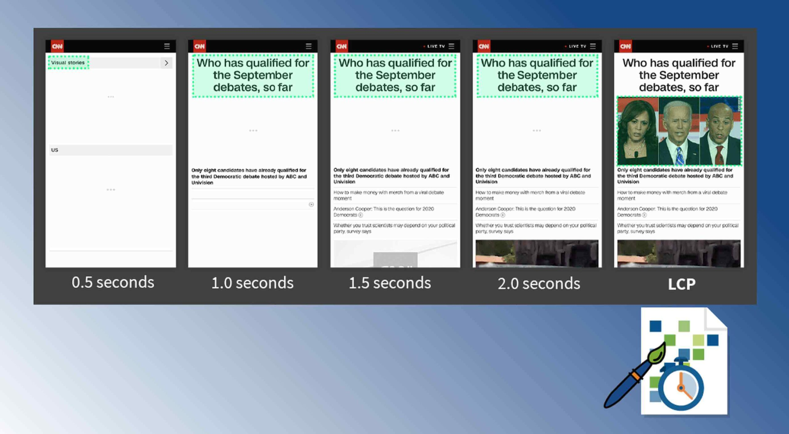
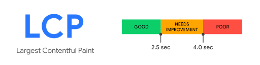
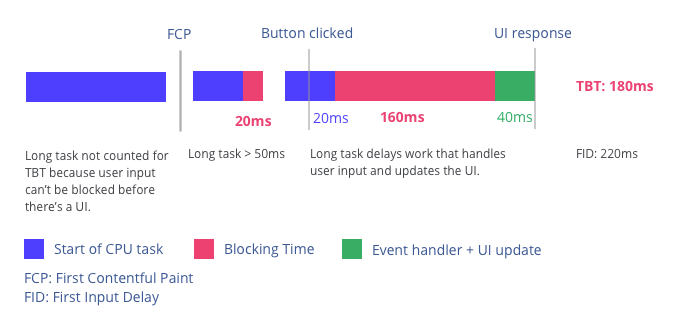
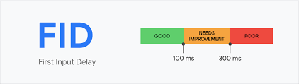
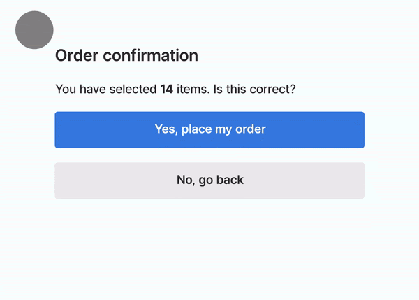
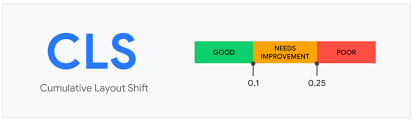
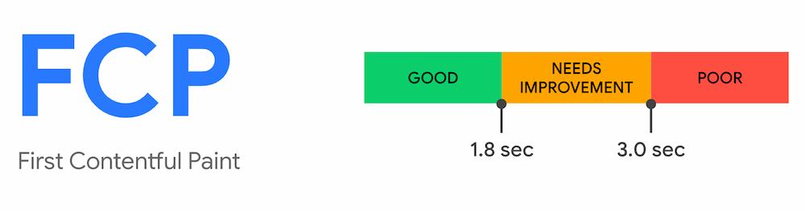

# 15회차

# 11장

사용자가 쾌적하게 하는 것도 중요함. 버그가 없는 앱을 만들어보자

## 웹사이트와 성능

최신 기술이 집약되어 있는 웹사이트라도 개발자에게만 찬양받고,  
사용자 경험이 안좋으면 외면 받음.  
반대로 비교적 오래된 기술로 만들어져도 잘 만들면 사용자가 좋아함.

웹사이트 성능에 따른 영향

- 1초 내로 로딩되는 사이트는 5초 내로 로딩되는 사이트 보다 구매자가 2.5배 높음
- 0 ~ 5초의 범위에서, 1초 로딩이 늦어질수록 전환율이 4.4%씩 떨어짐.
- 페이지 로드 시간이 0 ~ 2초 사이인 페이지에서 가장 전환율이 높음.
- 소비자의 70%는 페이지 속도가 온라인 커머스 사이트를 방문하는 데 영향을 미침.
- 절반 가까운 사람이 애니메이션, 로딩 보다는 속도가 중요하다 여김.
- 전체 웹페이지를 표시하는 데 필요한 최적의 평균 리소스 요청 수는 50회 미만.
- 웹 페이지 전체 요청 15.3초가 평균.
- 페이지 로드 시간이 1초에서 10초로 늘어날수록 모바일 사이트를 이탈 확률이 123%증가함.

이러한 웹서능을 개선하고 측정해보자

## 핵심 웹 지표란?

구글에서 만든 지표, 웹사이트에서 뛰어난 사용자 경험을 제공하는 데 필수적인 지표를 뜻함.

**핵심**

- 최대 콘테츠풀 페인트 - LCP
- 최소 입력 지연 - FID
- 누적 레이아웃 이동 - CLS

**서브**

- 최초 바이트까지의 시간 - TTFB
- 최초 콘테츠풀 시간 - FCP

## 최대 콘텐츠풀 페인트

### 정의

페이지가 처음으로 로드를 시작한 시점부터 뷰포트 내부에서 가장 큰 이미지, 텍스트를 렌더링하는 데 걸리는 시간.

큰 이미지와 텍스트

- &lt;img&gt;
- &lt;svg&gt; 내부의 &lt;image&gt;
- &lt;video&gt;
- url()을 통해 불러온 배경 이미지가 있는 요소
- 텍스트와 같이 인라인 텍스트 요소를 포함하고 있는 블록 레벨 요소(&lt;p&gt;, &lt;div>)

뷰포트 영역 밖에 넘치는 요소는 고려가 안됨.  
=> 콘텐츠 높이가 아무리 길어도, 뷰포트 영역만이 LCP에 영향을 미침.

### 의미

웹페이가 완전히 로딩 되었을 때의 기준치는 DOMContentLoaded임.  
DOMContentLoaded는 HTML 문서를 완전히 불러오고 파싱했을 때 발생하는 이벤트.  
=> 페이지의 document를 대상으로 일어나고 한 번만 호출됨.

하지만 DOMContentLoaded를 완전히 불러올 필요는 없고,  
사용자가 보는 화면이 완전히 렌더링된 상태면 만족하게 되있음.  
=> 이것의 지표가 바로 **최대 콘텐츠풀 페인트(LCP)**.

### 예시

페이지 로딩에 따라 최대 콘텐츠풀 페인트는 변화함.  
디바이스 크기, 리소스의 크기에따라 LCP지표의 값은 계속 달라질 수 있음.

### 기준 점수

  
JS API 호출하기, 잡다한 도구를 이용해서 측정할 수 있다.

### 개선 방안

좋은 점수를 얻는 방법을 알아보자.

- LCP 예상 영역에 이미지가 아닌 텍스트를 넣는다.
- 이미지를 쓸 때, svg내부에 img를 쓰지말자.
- 이미지를 무손실 압축으로 최소한의 용량으로 서비스하자.
- loading=lazy는 이미지를 중요하지 않은 리소스로 분류할 수 있으니 주의
- 애니메이션을 남발하지 말자.
- 클라이언트에서 빌드하지 말자.
- LCP 리소스는 같은 도메인에서 직접 호스팅하자.

## 최초 입력 지연(FID)

### 정의

웹사이트에서 사용자가 상호 작용을 했을 때 브라우저가 이벤트 핸들러 처리를 시작하기까지의 걸리는 시간.  
즉, 웹사이트의 반응 속도

### 의미

JS 실행 환경은 싱글쓰레드이기 때문에 지연이 필연적으로 발생함.  
=> 이벤트가 발생하는 시점에 최대한 메인 스레드가 다른 작업을 처리할 수 있게 여유를 만들어야함.  
사용자의 최초 입력에 해당하는 내용인 클릭, 터치, 타이핑 등을 대표로 측정해야함.

구글이 분류한 4가지의 사용자 경험 정의. RAIL를 알아보자.

- Response: 사용자의 입력에 대한 반응 속도. 50ms 미만으로 이벤트를 처리해라.  
  => 최초 입력 지연은 얘를 기준으로 초점을 맞추고 있음.
- Animation: 애니메이션의 각 프레임을 10ms 이하로
- Idle: 페이지가 50ms 이내에 입력에 응답할 것.
- Load: 5초 이내에 콘텐츠를 전달하고 언터랙션을 준비.

### 예제

사용자나 E2E 도구를 이용해 입력을 발생시켜보자.  
  
주의할 점은 이벤트 핸들러가 완료되는 데 걸리는 시간은 측정하지 않음.  
=> 이벤트 발생 ~ 이벤트 핸들러의 실행 사이의 시간만 측정함.

### 기준 점수

### 개선 방안

- 실행에 오래 걸리는 작업을 여러개로 분리.
- 우선순위가 낮은 것은 Suspense, lazy, dynamic등을 활용해서 나중에 불러오자.
- JS 코드를 최소화  
  => 번들링 크기를 줄이는 것. 필요없는 코드를 제거하자.
- 라이브러리, 프레임워크 JS는 async, defer을 이용해 지연시키자.

## 누적 레이아웃 이동(CLS)

### 정의

페이지의 생명주기 동안 발생하는 모든 예기치 않은 이동에 대한 지표.  
=> 사용자가 무언가를 클릭하려는 순간 다른 요소가 로딩되서 길막하는 경우.

### 의미

useEffect가 많을수록, 얘가 영향을 많이 미칠수록 CLS 점수가 낮아짐.  
=> useEffect가 비동기 요청으로 레이아웃을 변경하는 경우 원래있던 레이아웃이 밀려나거나 변경될 수 있음.

- 영향분율: 레이아웃 이동이 발생한 요소의 전체 높이와 뷰포트 높이의 비율  
  => ((레이아웃으로 인한 이동거리 + 요소의 높이)/ 100)
- 거리분율: 레이아웃 이동이 발생한 요소가 뷰포트 대비 얼마나 이동했는지.  
  => (레이아웃으로 인한 이동거리 / 전체 뷰포트)

### 예제

  
허.. 꼴받겠구만

### 기준 점수

### 개선 방안

- 스켈레톤 UI 같은걸로 무언가가 동적으로 뜰 것을 예측해서 공간을 확보해놓자.
- useEffect에서 요소에 영향을 미치는 작업 최소화, useLayoutEffect 사용
- 폰트 최적화. 기본 폰트가 보이고 나중에 폰트가 적용되는 경우.
- 적절한 이미지 크기 설정  
  => height: auto는 최적의 이미지를 보여줄 수 있지만, 레이아웃 이동이 크게 발생함.

### 핵심 웹 지표는 아니지만 성능 확인에 중요한 지표들

#### 최초 바이트까지의 시간(Time To First Byte, TTFB)

브라우저가 웹페이지의 첫 번째 바이트를 수신하는 데 걸리는 시간.  
=> 최초의 응답이 오는 바이트까지가 얼마나 걸리는지. 600ms를 넘지말자

개선방안

- SSR일 경우, 로직을 최적화하자 api호출 시 호출 횟수와 가져오는 정보 크기를 최소화하고, next.js를 쓴다면 getServerSideProps를 쓰자.
- 앱의 주된 사용자의 국적을 파악해 해당 국적과 가깝게 서버를 위치시키자.
- renderToNodeStream, renderToStaticNodeStream같은 스트리밍 API를 써보자.

#### 최초 콘텐츠풀 페인트(First Contentiful Paint, FCP)

페이지 로드 ~ 페이지 콘텐츠 일부가 화면에 렌더링 될 때까지의 시간.  
=> 웹사이트 접속하고 페이지에 뭐라도 뜨는 시간.

개선방안

- TTFB를 개선. 뭐라도 다운이 시작돼야 렌더링을 할 수 있음.
- JS, CSS 같은 렌더링을 가로막는 리소스를 최소화하고 방해하는 얘들은 비동기로 처리.
- Above the Fold 최적화. 스크롤을 굳히 하지 않아도 보이는 영역
- 페이지 리다이렉트 최소화
- DOM 크기 최소화

## 정리

대부분 웹사이트 만들면 기능과 버그에만 중점을 두는데, 성능도 매우 중요한 부분이다.  
=> 사용자는 열악하며, 느리고, 인내심도 짧다 잘 케어해주자.
