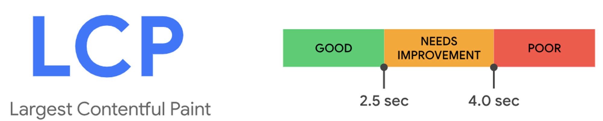
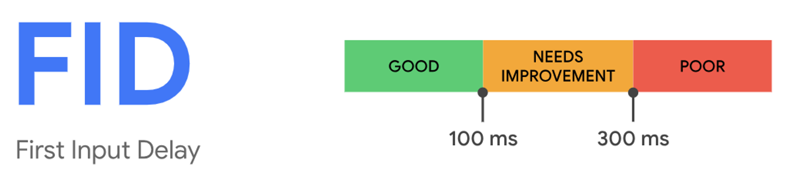
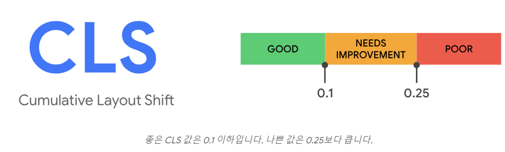

# [12장] 모든 웹 개발자가 관심을 가져야 할 핵심 지표

## 12.1 웹사이트와 성능

1. 웹사이트를 방문한 목적을 손쉽게 달성할 수 있어야 함
2. 목적을 달성하는 데 걸리는 시간이 짧아야 함
3. 웹사이트에서 개인정보가 누출되는 등의 사고 없이 보안이 철저해야 함

## 12.2 핵심 웹 지표란?

- 최대 콘텐츠풀 페인트(LCP)
- 최초 입력 지연(FID)
- 누적 레이아웃 이동(CLS)

## 12.3 최대 콘텐츠풀 페인트(LCP)

- 페이지가 처음으로 로드를 시작한 시전부터 뷰포트 내부에서 가장 큰 이미지 또는 텍스트를 렌더링하는 데 걸리는 시간
  - ``
  - `<svg>` 내부의 `<image>`
  - `poster` 속성을 사용하는 `<video>`
  - `url()`을 통해 불러온 배경 이미지가 있는 요소
  - 텍스트와 같이 인라인 텍스트 요소를 포함하고 있는 블록 레벨 요소 (블록 레벨 요소에는 `
`, `
` 등 포함)

- Google은 LCP 성능 목표를 2.5초 이내로 권장
- `DOMContentLoaded` 이벤트는 스타일시트나 이미지 등의 로딩을 기다리지 않기 때문에 ‘웹페이지가 로딩이 완료되어 사용자에게 노출되기까지 걸리는 시간’이라고 보기는 어렵다. 또한 사용자 페이지 로딩을 체감하기 위해서 모든 페이지를 로딩될 필요가 없기 때문에 뷰포트를 기준으로 하는 LCP가 지표로 만들어졌다고 볼 수 있다.

## 12.4 최초 입력 지연(FID)

- 사용자가 웹페이지와 처음 상호작용하는 시점부터 브라우저가 실제로 해당 입력을 처리할 수 있게 되는 시간을 측정하는 웹 성능 지표

- Google은 FID 성능 목표를 100ms 이내로 권장
- 웹사이트 내에 이벤트 반응이 늦어지는 이유는 대규모 렌더링이 일어나거나 자바스크립트 분석 등을 이유로 메인 스레드가 작업을 처리하는 데에 리소스를 할애하고 있기 때문이다. **자바스크립트 실행 환경은 ‘싱글 스레드’이기 때문에 그 외의 이벤트 리스너 같은 작업을 실행할 수 없어 지연이 발생하게 된다.**
- 구글은 사용자 경험을 크게 4가지로 분류해 정의 (RAIL)
  - **Response**: 사용자 입력에 대한 반응 속도, 50ms 미만으로 이벤트를 처리할 것
  - **Animation**: 애니메이션의 각 프레임을 10ms 이하로 생성할 것
  - **Idle**: 유휴 시간을 극대화해 페이지가 50ms 이내에 사용자 입력에 응답하도록 할 것
  - **Load**: 5초 이내에 콘텐츠를 전달하고 인터렉션을 준비할 것
- **FID는 R에 해당하는 응답에 초점을 맞추고 있습니다.**

## 12.5 누적 레이아웃 이동(CLS)

- 웹페이지에서 발생하는 레이아웃 변화의 누적 점수를 측정

- Google은 CLS 성능 목표를 0.1 이하로 권장

**✨TTFB (Time To First Byte)**

- 페이지를 요청했을 때 서버에서 데이터의 첫 번째 바이트가 도착하는 시간 (텍스트, 이미지, svg 등)

**✨FCP (First Contentful Paint)**

- 페이지가 로드되기 시작하고 컨텐츠의 일부가 화면에 렌더링 될 때 까지의 시간

## 참고

- https://web.dev/articles/lcp
- https://web.dev/articles/fid
- https://web.dev/articles/cls
