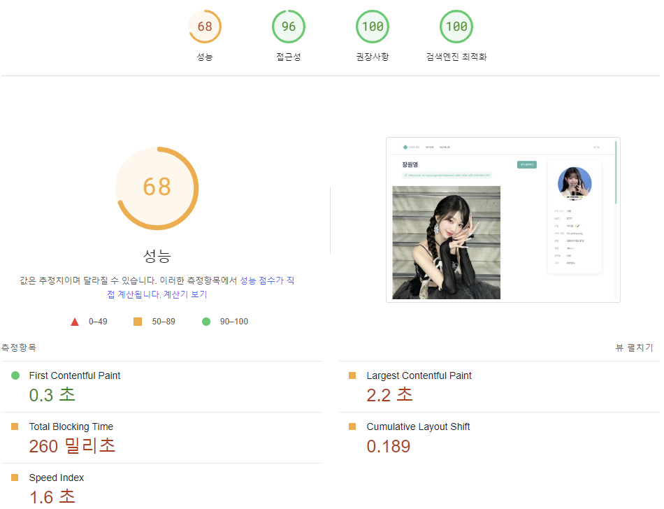
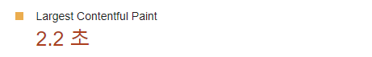
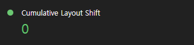

# 12. 모든 웹 개발자가 관심을 가져야 할 핵심 웹 지표

**웹 페이지를 만들고, 서비스한다고 해서 웹 개발자의 일이 끝나는 것은 아니다.**

 

## 12.1 웹 사이트와 성능

### ✨ 웹 사이트에 접속했을 때 공통적으로 기대하는 사항을 충족시킨다면 그것은 결국 좋은 코드라고 볼 수 있다.

### 웹 사이트 기대 사항

- 웹 사이트를 방문한 목적을 손쉽게 달성

- 해당 목적을 달성하는 데까지 걸릴 시간의 감소

- 개인 정보 노출 등의 사고가 없는 철저한 보안

 

### ✅ 결국 웹 서비스의 성능과 요소는 반비례할 수 밖에 없으며 밸런스를 잘 조절하는 것이 매우 중요하다.

- 하지만 평균적으로 개발자의 기기는 일반인보다 좋아 문제를 잘 느끼지 못하는 경우가 많다.

- 또한 항상 서비스 출시를 목표로 성능 개선보단 서비스의 완성과 버그 수정에 더욱 몰두하기 때문에 이러한 작업을 진행하기 어렵다.

- 하지만 성능에도 항상 신경써야하는 것이 개발자의 본연의 일 중 하나란 것을 잊으면 안된다.

 

### 12.2 핵심 웹 지표란?

> 대표적인 성능 지표 테스트 서비스인 `light house`

### ✨ 구글이 제시한 '좋은 웹사이트'에 부합하는 핵심 웹 지표는 이러하다.

- 최대 콘텐츠풀 페인트(LCP : Largest Contentful Paint)

- 최초 입력 지연(FID : First Input Delay)

- 누적 레이아웃 이동(CLS : Cumulative Layout Shift)

👇 핵심까진 아니나 특정 문제 진단에 사용 가능한 지표

- 최초 바이트까지의 시간(TTFB : Time To First Byte)

- 최초 콘텐츠풀 시간(FCP : First Contentful Paint)

 

## 12.3 최대 콘텐츠풀 페인트(LCP)

### 12.3.1 정의

---

- 페이지가 처음으로 로드를 시작한 시점부터 뷰포트 내부에서 가장 큰 `이미지` 또는 `텍스트`를 렌더링하는 데 걸리는 시간

- 결국 뷰포트란 화면의 크기에 의존하므로, 뷰포트 크기는 사용하는 기기마다 다르다.

### 📌 여기서 말하는 큰 '이미지'나 '텍스트' 란 이러한 것들을 의미한다.

- ``

- `<svg>` 내부의 `<image>`

- `poster` 속성을 사용하는 `<video>`

- `url()` 을 통해 불러온 배경 이미지가 있는 요소

- 인라인 텍스트 요소를 포함하는 요소

 

### 📌 각 요소가 등장한 시점부터 텍스트나 이미지가 완전히 로딩되는 시점까지의 시간

- 결국 아무리 콘텐츠 높이가 길어도 LCP에 영향을 미치는 것은 뷰포트 영역 뿐이다.

 

### 12.3.2 의미

---

### 📌 사용자가 페이지가 로딩됐다고 느끼는 시점은 결국 사용자가 보는 화면이 잘 보일 때이다.

- 결국 이 지표는 사용자가 보는 화면을 기준으로 속도를 객관적으로 판단하기 위한 지표이다.

 

### 12.3.3 예제

---

 

### 📌 페이지 로딩에 따라 변화하는 지표로서 디바이스나 이미지의 크기에 따라 그 지표의 값은 변경될 수 있다.

- 실제로 중급 프로젝트에서 내가 만들었던 위키 페치지를 측정해보면 원영 공주의 사진을 로딩해야 하기 때문에 속도가 조금 느린 것을 확인할 수 있다.

 

### 12.3.4 기준 점수

---

### 📌 보통 2.5초 이내로 응답이 오면 좋음, 4초 이내면 보통, 그 이상은 나쁨으로 구분한다.

 

### 12.3.5 개선 방안

---

### 📌 해당 지표의 점수를 높힐 수 있는 방법은 무엇일까?

- 이미지보단 텍스트의 사용을 지향하자.

- 하지만 텍스트보다 이미지를 더 많이 사용하는 경우도 있을 것이다.

  - 간단하게 말하자면 위에서 언급했던 \의 경우 정말 좋다.

  - 또한 \<video>의 poster 속성 사용도 좋은 사용 예시 중 하나이며, \<svg>의 \<image>나 background url()의 사용은 지양하는 것이 좋다.

### 📌 그 밖의 유의할만 한 사항은?

- `loading=lazy` 전략 사용에 주의한다. 이는 필요할 때만 이미지를 로딩하는 전략으로, 지표 점수에는 별 도움이 되지 않는다.

- 애니메이션 사용도 도움이 되지 않는다.

- 클라이언트에서 빌드하는 것보다 서버에서 빌드한 것을 가져오는 것은 도움이 된다.

- 중요한 리소스는 직접 다루되 그 외의 리소스는 이미지 최적화 서비스를 사용하는 방식으로 관리한다.

 

## 12.4 최초 입력 지연(FID)

### 12.4.1 정의

---

### 📌 사용자가 페이지와 처음 상호작용할 때부터 응답으로 브라우저가 실제 이벤트 핸들러 처리를 시작하기까지 걸리는 시간

- 최초의 입력 하나에 대해서만 응답 지연이 얼마나 걸리는지 측정한다.

 

### 12.4.2 의미

### 📌 기본적으로 입력 이벤트를 고의로 막는 경우는 없지만, 웹사이트의 반응이 늦는 이유는 해당 입력을 처리하는 브라우저의 메인 스레드가 바쁘기 때문이다.

- 이는 브라우저가 입력뿐 아니라 다른 작업에 리소스를 할애하고 있음을 의미한다.

- 따라서 이벤트 발생 시점에 최대한 메인 스레드가 다른 작업을 할 수 있도록 여유를 만들어둬야한다.

> 구글은 사용자 경험을 크게 4가지로 정의하며, 이를 RAIL(Response, Animation, Idle, Load)이라 칭한다. 그 중 FID 같은 경우 Response에 해당한다.

 

### 12.4.3 예제

---

### 📌 FID의 경우 사용자가 직접 입력 이벤트를 발생시켜야 한다.

- 각자 만들었던 프로젝트를 테스트해보자.

- `Event Timing API` 를 사용하여 이벤트 핸들러 적용 시간을 측정할 수 있다.

 

### 12.4.4 기준 점수

---

### 📌 보통 좋은 점수는 100ms 이내이며, 300ms 이내인 경우 보통, 그 이상은 나쁨이다.

 

### 12.4.5 개선 방안

---

### 📌 결국 이를 처리하는 메인 스레드의 성능을 위해 여유를 줘야한다.

- 긴 작업(long task)이 있는 경우 이것이 꼭 브라우저에서 진행해야 하거나 나눠도 되지 않는 경우를 제외한다면 항상 신경쓰는것이 좋다.

- JS 번들링 시 필요없는 코드가 포함되지 않도록 항상 주의한다.

- 또한 번외적으로 폴리필을 사용하는 경우, 이게 꼭 필요한지와 필요한 환경인지를 항상 체크한다. (폴리필은 생각보다 영향을 많이 끼친다.)

- 또한 타사 JS(GE 등)는 `<scirpt>`의 `async`, `defer` 등의 키워드를 통해 지연 불러오기를 하는 것이 좋다.

 

## 12.5 누적 레이아웃 이동(CLS)

 

### 12.5.1 정의

---

### 📌 페이지의 생명주기 동안 발생하는 모든 예기치 않은 이동에 대한 지표를 계산하는 것

- 숫자가 작을 수록 성능이 좋은 웹사이트다.

 

### 12.5.2 의미

---

### 📌 CLP와 마찬가지로 뷰포트 기준에서 측정하며, 사용자 액션으로 발생하는 레이아웃 변경은 포함하지 않는다.

- 예를 들면 리액트의 최초 렌더링 이후 `useEffect` 를 통해 사용자 UI를 변경시키는 경우가 있겠다.

 

### 12.5.3 예제

---

### 📌 페이지 로드 후 생성되는 배너의 경우 추가적인 사용자 UI 변경이 일어난다고 짐작해볼 수 있다.

- CLP와 비슷하게 기기의 차이에 따라 발생하는 뷰포트의 크기 또한 이 점수에 영향을 끼친다. (작을수록 유리)

- 또한 스켈레톤 UI의 사용이나, 미리 렌더링될 위치를 계산하여 HTML 처리를 해준다면 더 좋은 점수를 받을 수 있다.

 

### 12.5.4 기준 점수

---

### 📌 일반적으로 0.1 이하인 경우 좋음, 0.25 이하인 경우 보통, 그 이상은 나쁨이다.

 

### 12.5.5 개선방안

---

### 📌 일반적으로 UI가 미리 보여질 공간에 대한 처리를 하는 것이 좋다.

- HTML을 통한 위치 계산, 폰트 로딩 최적화, 적절한 이미지 크기 지정 등이 있을 수 있겠다.

 

### 12.5.6 핵심 웹 지표는 아니지만 성능 확인에 중요한 지표들

---

### 📌 최초 바이트까지의 시간(TTFB), 최초 콘텐츠풀 페인트(FCP) 등이 있다.

- 최초의 응답이 오는 바이트까지의 시간이나 페이지의 일부 콘텐츠가 처음 로드되는 시간 등도 페이지 개선을 위한 웹 지표에 중요한 것들이다.

 

### 12.6 정리

---

### 📌 웹 페이지는 '기능을 완성했는가?', '버그는 얼마나 적은가?' 등도 중요하지만 이러한 웹 성능 또한 중요하다.

- 개발자라면 성능 또한 완성도 만큼이나 중요하게 생각해야한다.

- 따라서 이러한 웹 지표를 효율적으로 사용한다면 만든 사이트의 완성도를 더욱 끌어올릴 수 있을 것이다.
