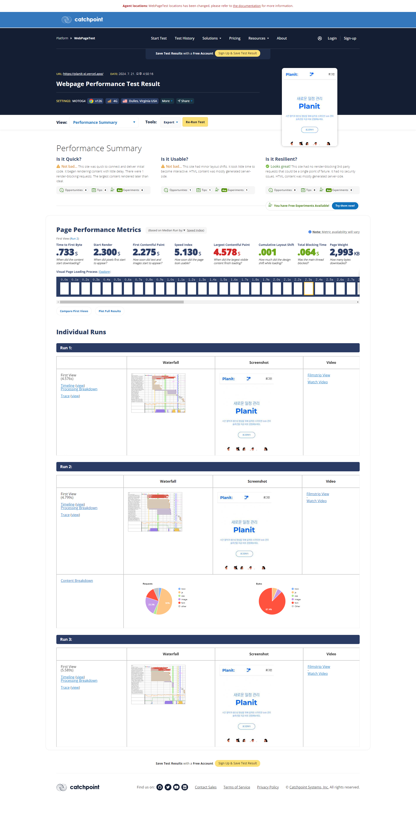
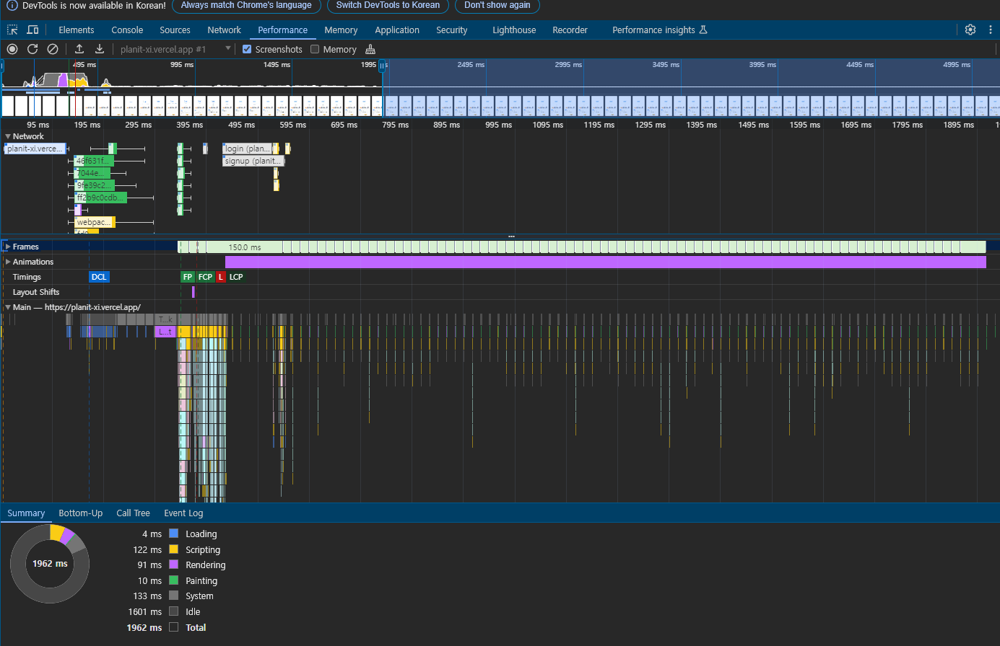

# 13장: 웹페이지의 성능을 측정하는 다양한 방법

## 13.1 애플리케이션에서 확인하기

### create-react-app

create-react-app을 통해 프로젝트를 생성하는 경우 `reportWebBitals.ts`라는 파일을 확인할 수 있다.

```ts
reportWebVitals(console.log);
```

### create-next-app

Next.js는 성능 측정을 할 수 있는 메서드인 NextWebBitalMetric을 제공한다.

이때 핵심 웹 지표 외에도 Next.js에서 특화된 사용자 지표를 제공한다.

- Next.js-hydration: 하이드레이션하는 데 걸리는 시간
- Next.js-route-change-to-render: 페이지가 경로를 변경한 후 렌더링을 시작하는 데 걸리는 시간
- Next.js-render: 경로 변경이 완료된 후 페이지를 렌더링하는 데 걸린 시간

## 13.2 구글 라이트하우스

### 구글 라이트하우스 - Navigation

> 페이지에 접속했을 때부터 페이지 로딩이 완료될 때까지의 성능을 측정하는 모드

#### Performance

웹페이지의 성능과 관련된 지표를 확인할 수 있는 영역이다.
핵심 웹 지표인 FCP, LCP, CLS 외에도 3가지 추가적인 지표가 있다.

- Time to Interactive: 페이지에서 사용자가 완전히 상호작용할 수 있을 때까지 걸리는 시간
- Speed Index: 페이지가 로드되는 동안 콘텐츠가 얼마나 빨리 시각적으로 표시되는지를 계산한다.
- Total Blocking Time: 메인 스레드에서 긴 작업(50ms 이상)이 수행될 때마다 메인 스레드가 차단된 것으로 간주한다.
  이렇게 차단된 시간을 모아서 총 차단 시간이라고 한다.

#### Accessibility

접근성이란 신체적으로 불편한 사람들이 일반적인 사용자와 동등하게 웹페이지를 이용할 수 있도록 보장하는 것을 말한다.

#### Best Practices

웹사이트를 개발할 때 고려해야 할 요소들을 얼마나 지키고 있는지 확인할 수 있다.
권장사항에는 보안, 표준 모드, 최신 라이브러리, 소스 맵 등 다양한 요소들이 포함돼 있다.

#### SEO

검색엔진이 쉽게 웹페이지 정보를 가져가서 공개할 수 있도록 최적화돼 있는지를 확인한다.
robots.txt가 유효한지, 이미지와 링크에 설명 문자가 존재하는지, `<meta>`나 `<title>` 등으로 페이지의 정보를 빠르게 확인할 수 있는지 등을 확인한다.

### 구글 라이트하우스 - Timespan

앞서 탐색 모드가 페이지가 로딩되면서 지표를 측정한 것이라면 기간 모드는 웹페이지를 탐색하는 동안의 지표를 측정하는 것이다.
여기서 확인할 수 있는 지표들은 크게 성능과 권장사항으로 앞서 탐색 모드와 크게 다르지 않다.

여기서 앞에 볼 수 없었던 내용 두 가지를 확인할 수 있는데 바로 Trace와 Treemap이다.

- View Trace: 웹 성능을 추적한 기간을 성능 탭에서 보여준다.
- View Treemap: 페이지를 불러올 때 함께 로딩한 모든 리소스를 함께 모아서 볼 수 있는 곳

### 구글 라이트하우스 - Snapshot

탐색 모드와 매우 유사하지만 현재 페이지 상태를 기준으로 분석한다는 점이 다르다.
즉, 페이지 로딩이 아닌 특정 페이지 상태를 기준으로 분석한다.

## 13.3 WebPageTest



## 13.4 크롬 개발자 도구

### Performance



#### 메뉴

Start Recording으로 원하는 액션을 수행하면서 웹사이트 성능을 측정하거나,
새로고침으로 페이지 로드 시 성능을 측정할 수 있다.

#### 요약

요약 탭에서는 측정 기간의 CPU, 네트워크 요청, 스크린숏, 메모리 점유율 등을 요약해서 볼 수 있다.

#### 네트워크

성능 측정 기간 동안에 발생한 모든 네트워크 요청을 확인할 수 있다.

각 색깔에 따라 어떠한 종류의 요청인지 확인할 수 있다.

- 파란색: HTML
- 보라색: CSS
- 노란색: JS
- 초록색: 이미지
- 회색: 기타(폰트, JSON)

위에 있는 요청이 우선순위가 높은 요청이다.

각 요청은 그래프로 표시돼 있는데, 이 그래프를 읽는 방법은 다음과 같다.

- 왼쪽 선은 연결이 시작되기 위한 기간을 나타낸다.
- 색이 더 연한 왼쪽은 요청을 보내고 최초 바이트가 오기까지의 대기 시간을 의미한다.
- 색이 진한 오른쪽은 콘텐츠를 다운로드하는 데 걸리는 시간을 의미한다.
- 오른쪽 선은 메인 스레드의 응답을 기다리는 시간이다.

진한 색 영역이 크다면 내용이 큰 파일이른 것을 의미하고,
연한색 영역이 크다면 다운로드 요청에 대한 응답을 받는 데 오래 걸린다는 것을 알 수 있다.

#### Main

시간의 흐름에 따라 메인 스레드의 작업은 어떻게 이뤄졌는지,
또 JS 힙 영역은 어떻게 변화하는지 등을 확인할 수 있다.

---

### 새로 알게된 개념

- 구글 Lighthouse 사용 방법
- 개발자 도구 성능 탭 사용 방법
