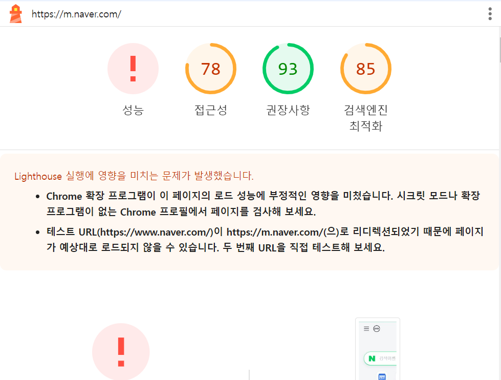
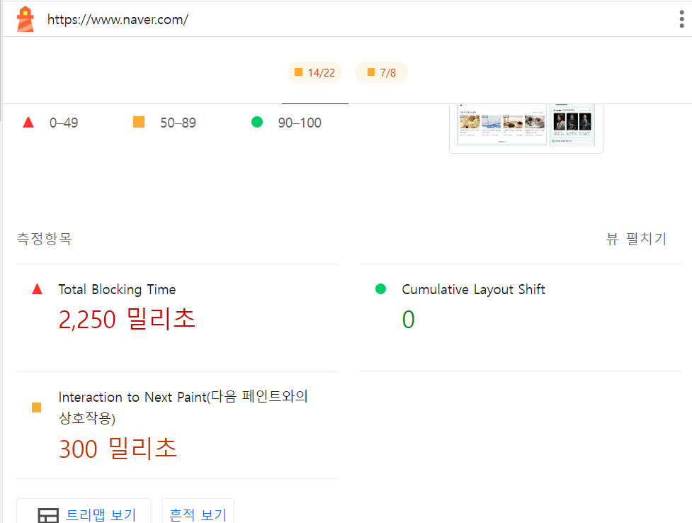
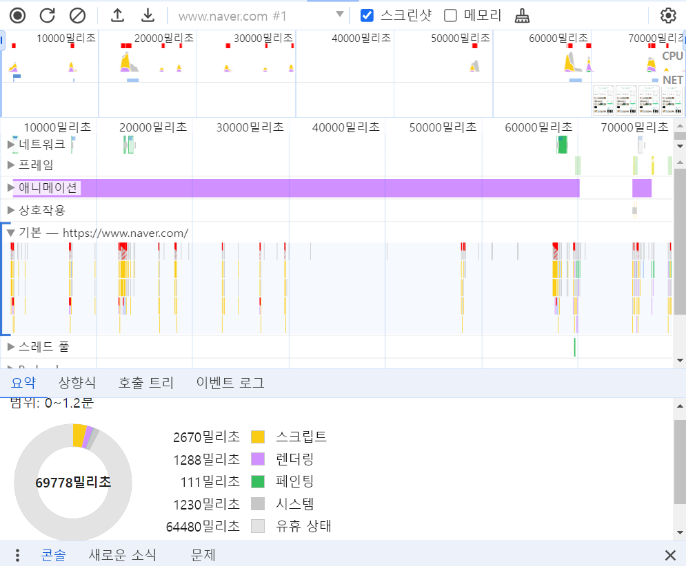
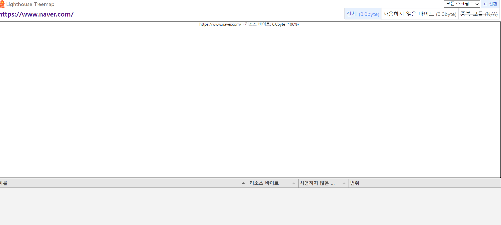
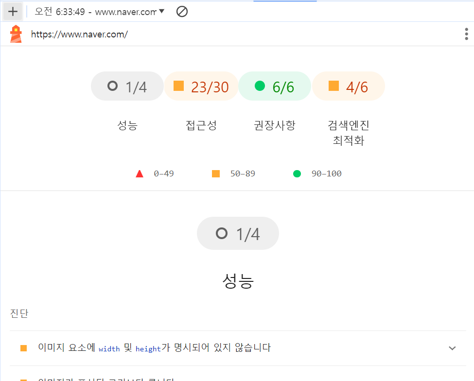
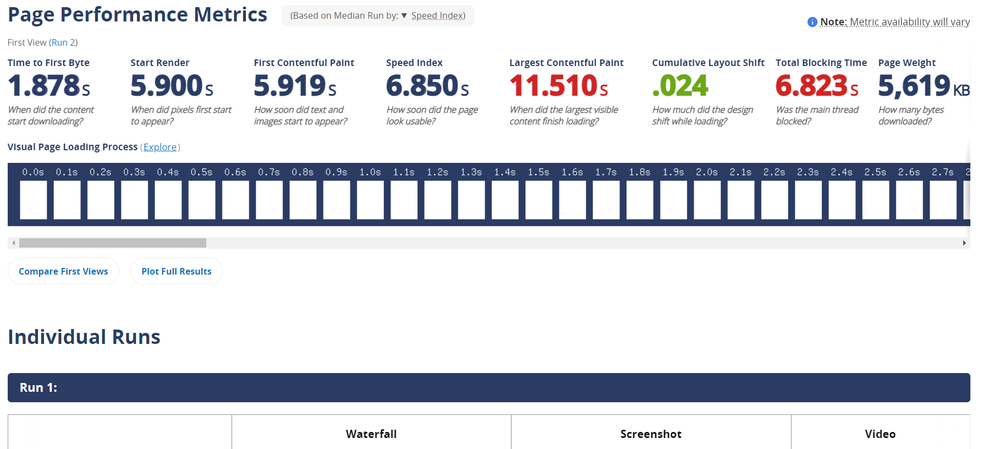
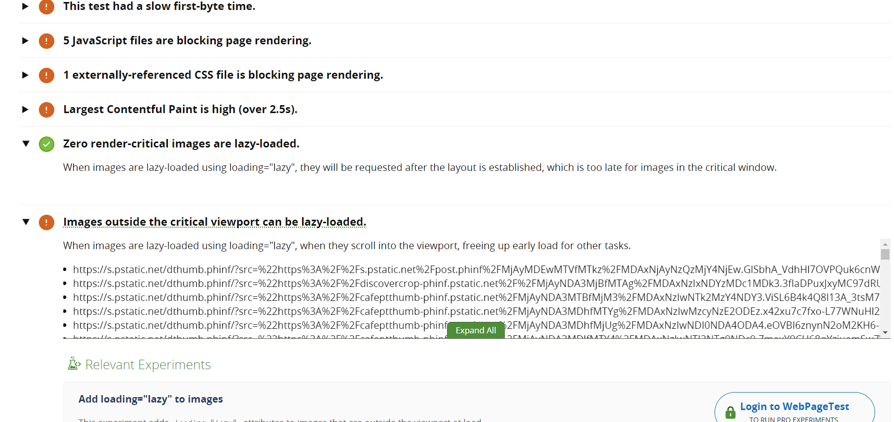
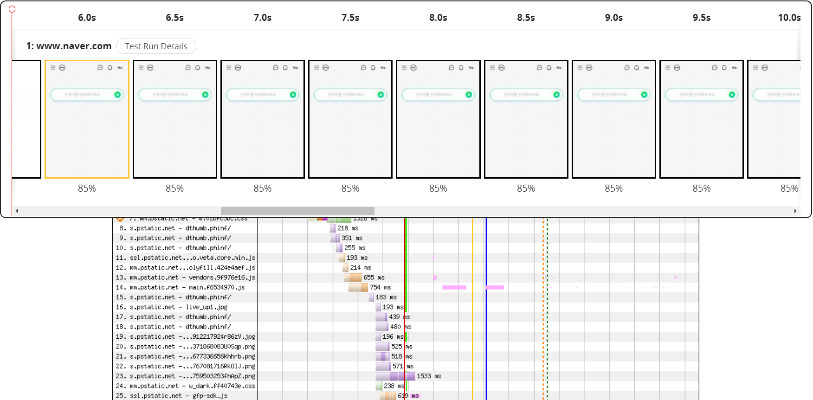
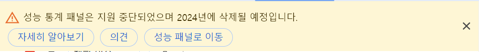

# 16회차

# 13장

## 애플리케이션에서 확인하기

웹사이트의 성능을 브라우저 말고 앱에서 확인해보자.

### create-react-app

리액트에서 성능을 측정해보자.

```JS
import { ReportHandler} from 'web-vitals'

const reportWebVitals = (onPerfEnter?: ReportHandler) => {
  if(onPerfEnter && onPerfEntry instanceOf function) {
    import('web-vitals').then(({ getCLS, getFID, getFCP, getLCP, getTTFB})) => {
      getCLS(onPerfEntry)
      getFID(onPerfEntry)
      getFCP(onPerfEntry)
      getLCP(onPerfEntry)
      getTTFB(onPerfEntry)
    }
  }
}

export default reportWebVitals
```

- reportWebVitals 함수로 웹 성능을 측정.(CLS, FID, FCP, LCP, TTFB)  
  => web-vitals 라이브러리 이용  
  => performanceObserver라는 API 사용으로 JS 라이브러리 수준으로도 성능 측정 가능.
- ReportHandler는 성능 객체 Metric을 인수로 받아, Metric을 원하는대로 다룸.  
  => 콘솔 출력뿐만 아니라 서버로도 전송 가능.

sendBeacon API나 fetch 등의 API로 서버, 구글 애널리틱스로 정보를 보낼수도 있다.

### create-next-app

create-react-app과 비슷하지만, NextWebVitalsMetric라는 성능 측정 메서드가 제공됨.

```JS
import { AppProps, NextWebVitalsMetric } from 'next/app'

/**
 * @description 메트릭을 측정한다
 */
/*

export declare type NextWebVitalsMetric = {
  id: string;
  startTime: number;
  value: number;
} & ({
  label: 'web-vital';
  name: 'FCP' | 'LCP' | 'CLS' | 'FID' | 'TTFB' | 'INP';
} | {
  label: 'custom';
  name: 'Next.js-hydration' | 'Next.js-route-change-to-render' | 'Next.js-render';
})
*/
export function reportWebVitals(metric: NextWebVitalsMetric) {
  console.log(metric) // TTFB, FID, LCP 등의 로그가 출력됨.
}

function MyApp({ Component, pageProps }: AppProps) {
  return <Component {...pageProps}>
}

export default MyAPP
```

- Next.js-hydration: 서버 사이드에서 렌더링되어 하이드레이션에 걸린 시간  
  => react가 아닌 next.js에서는 최초에 ssr하기 때문에 하이드레이션 뒤따름.
- Next.js-route-change-to-render: 페이지 경로를 변경 후 렌더링 시작까지 걸린 시간
- Next.js-render: 경로 변경 후 렌더링까지 걸린 시간

위 지표들로 SSR, getServerSideProps 걸린 시간들을 주의 깊게 확인해보자.

## 구글 라이트 하우스

reportWebVitals는 코드의 수정과 사전 준비 필요라는 단점이 있다.  
구글 라이트 하우스를 살펴보자.

- 코드 수정이나 배포, 수집 업어도됨.
- 구글에서 제공, 오픈소스로 운영
- 접근성, PWA, SEO 등 측정이나 점검 가능.
- 개발자 도구에서 사용가능, CLI 명령어로 지표 수집도됨.

### 구글 라이트하우스 - 탐색 모드

웹페이지 접속부터 완료될 때 까지의 성능을 측정하는 모드

**성능**

- FCP, LCP, CLS 존재.
- Time to interactive에 상호작용 할 수 있을 때까지 걸리는 시간 측정
- Speed Index에 콘텐츠가 표시되는 속도 계산.
- TOtal Blocking Time: 메인 스레드에서 실행하는 작업이 50ms 이상인 것들을 합첬을 때의 시간.

**접근성**

- 신체가 불편한 사람들이 웹페이지를 얼마나 편하게 이용하냐의 정도.
- HTML, CSS 등에 적절한 대안을 삽입.

**권장사항**

- 웹사이트의 기본이 돼있는지.
- 보안, 표준 모드, 최신 라이브러리, 소스 맵 등의 요소가 포함됨.

**검색 엔진 최적화**

- 검색엔진이 얼마나 쉽게 웹페이지 정보를 가져가서 공개하느냐.
- 이미지, 링크에 설명 문자를 넣거나 meta, title태그를 잘쓰면 올라감.

### 구글 라이트하우스 - 기간 모드

실제 웹페이지를 탐색하는 동안의 지표.  
기간 모드 누르고 성능 측정 원하는 작업 수행 후 종료하면됨.


#### 흔적

웹 성능을 추적한 기간을 보여줌.  


#### 트리맵

페이지를 불러올 때 로딩한 모든 리소를 보여줌.  
=> 웹페이지의 전체 JS 리소스 중 어떤 파일이 로딩 중 어느 정도 차지했는지 비율과 데이터 크기를 확인 가능.  

여기 나타난 리소스들을 소스 탭에서 파일명을 입력해 범인을 찾아보자.  
왜 내가하면 암것도 안뜨지??

### 구글 라이트하우스 - 스냅샷

탐색 모드와 유사하지만 현재 페이지 상태를 기준으로 분석.  


## WebPageTest

유료와 무료 버전이 있으며, 무료로 제공되는 기능만 알아보자.

- Site Performance: 웹사이트의 성능을 분석
- Core Web Vitals: 웹사이트의 핵심 웹 지표를 확인
- LIghthouse: 구글 라이트하우스.
- Visual Comparison: 2개 이상의 사이트를 동시에 실행해 로딩 과정 비교.
- Traceroute: 네트워크 경로를 확인

### Performance Summary

https://www.webpagetest.org/에서 Site Performance를 선택 후 테스트 시작 ㄱㄱ  
  
네이버의 성능.

### Opportunities & Experiments

- TTFB 점검
- 렌더링 블로킹 하는 JS, CSS 확인
- 최초 콘텐츠풀 페인트 2.5초 이내인지 확인



### Filmstrip

웹사이트를 시간의 흐름에따라 어떻게 그려지고, 어떤 리소스가 불러와졌는지 보여줌.  
이 지표만으로도 문제점과 개선 방안을 파악할 수 있다함.  


### Details

Filmstrip에서 보여준 내용을 자세히 보여줌.

### Web Vitals

LCP, CLS, TBT를 자세히 보여줌.

### Optimizations

리소스들이 얼마나 최적화돼 있는지 나타냄.

### Content

웹사이트에서 제공하는 콘텐츠, 애셋을 종류별로 묶어 통계로 나타냄.  
크기와 로딩 과정 확인 가능.

### Domains

Content 메뉴에서 보여준 애셋들이 어느 도메인에서 왔는지를 확인 가능.  
=> 중요 리소스는 웹사이트와 같은 곳에서 요청할수록 소요되는 비용이 줄음.

### Console Log

사용자가 웹페이제 접속했을 때 console.log로 뭐가 기록됐는지 확인.  
=> 디버깅 목적이면 환경 변수로 개발자만 볼 수 있게하자.

### Detected Technologies

웹사이트를 개발하는 데 사용된 기술 확인 가능 <= Goat인데?

### Main-thread Processing

함수실행, HTML 파싱, 페인팅, 스크립트 분석 등 확인 가능.  
유휴시간은 포함하지 않는다.  
=> Timing Breakdown에서 유후 시간을 포함한 작업을 확인하자.

### Lighthouse Report

구글 라이트하우스 리포트를 확인 가능.  
=> 개발자 도구 버전과 다르게 일반적인 모바일 기기의 브라우저에서 측정함.

### 기타

WebPageTest 외부에서 제공하는 서비스들. 외부 페이지로 이동함.

## 크롬 개발자 도구

개발된 지 오래되거나, 개발자와 운영자가 다른 경우, 번들만으로는 문제 짐작이 안되면 얘 써야함.  
  
  
=> 2024년에는 중단되었으므로 보내주자...

## 정리

- 성능을 개선하는 것은 개발 이상으로 여렵다. 반복적으로 탐색하자.
- 0.1초 개선만으로도 사용자들은 체감한다. 책임감을 가져라.
- 변하지 않는 HTML, JS, CSS를 소중히하자.
- 성능 규범을 잘지키면 성장할 수 있다. 파이팅!

### 알게된거

- 걍 LightHouse하나면 다 될듯.
