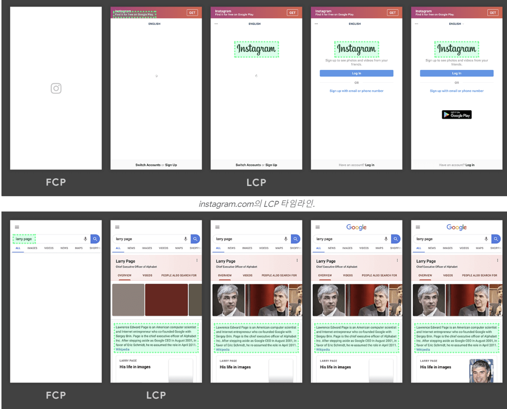

# [13장] 웹페이지의 성능을 측정하는 다양한 방법

## 13.1 애플리케이션에서 확인하기

**✨create-react-app**

```jsx
// src/reportWebVitals.js
export function reportWebVitals(onPerfEntry) {
  if (onPerfEntry && onPerfEntry instanceof Function) {
    import('web-vitals').then(({ getCLS, getFID, getFCP, getLCP, getTTFB }) => {
      getCLS(onPerfEntry)
      getFID(onPerfEntry)
      getFCP(onPerfEntry)
      getLCP(onPerfEntry)
      getTTFB(onPerfEntry)
    })
  }
}
```

- **reportWebVitals**함수를 웹에서 성능을 측정하기 위한 함수
- 누적 레이아웃 이동(CLS), 최초 입력 지연(FID), 최초 콘텐츠풀 페인트(FCP), 최대 콘텐츠풀 페인팅(LCP), 첫 바이트까지의 시간(TTFB)을 측정하는 용도로 사용됨.
  → web-vitals 라이브러리 덕분
  → PerformanceObserver API를 사용해 브라우저의 웹페이지 성능을 측정할 수 있다.

```jsx
export function reportHandler(metric) {
  console.log(metric)
}
```

- reportHandler는 단순히 성능 객체인 Metric를 인수로 받는 함수 타입으로, Metric을 원하는 대로 다룰 수 있다. → 콘솔 출력뿐만 아니라 서버 전송 가능


> ❓**Metric**
>
> - `name`: 측정된 성능 지표의 이름 (예: 'CLS', 'FID', 'LCP', 'FCP', 'TTFB')
> - `value`: 측정된 성능 지표의 값
> - `id`: 지표의 고유 식별자
> - `delta`: 지표의 변화량 (기존 값과 새로운 값의 차이)

```jsx
// 성능 지표를 서버로 전송해
// 중앙에서 모니터링하거나, 데이터 분석 도구와 연동할 수 있다.
export function reportHandler(metric) {
  fetch('/api/metrics', {
    method: 'POST',
    headers: {
      'Content-Type': 'application/json',
    },
    body: JSON.stringify(metric),
  }).catch((err) => {
    console.error('Error reporting metrics:', err)
  })
}
```

**✨create-next-app**

- NextWebVitalsMetric

```jsx
// pages/_app.tsx
import { AppProps } from 'next/app'
import { reportWebVitals, NextWebVitalsMetric } from 'next-web-vitals'

function MyApp({ Component, pageProps }: AppProps) {
  return <Component {...pageProps} />
}

export function reportWebVitals(metric: NextWebVitalsMetric) {
  console.log(metric)

  // 성능 지표를 분석 엔드포인트로 전송할 수도 있다
  // fetch('/api/metrics', {
  //   method: 'POST',
  //   headers: {
  //     'Content-Type': 'application/json',
  //   },
  //   body: JSON.stringify(metric),
  // });
}

export default MyApp
```

[Next에 특화된 사용자 지표]

- Next.js-hydration: 페이지가 서버 사이드에서 렌더링되어 하이드레이션하는 데 걸린 시간
- Next.js-route-change-to-render: 페이지가 경로를 변경한 후 페이지를 렌더링을 시작하는 데 걸리는 시간
- Next.js-render: 경로 변경이 완료된 후 페이지를 렌더링하는 데 걸린 시간

→ 최조에는 Next.js-hydration 지표가 있다. (Next.js는 최초에 서버 사이드 렌더링을 수행하기 때문에 필연적으로 리액트의 하이드레이션 작업이 뒤따른다.)

→ 클라이언트 사이드 라우팅이 일어나는 한 Next.js-route-change-to-render와 Next.js-render만 번갈아 나타난다.

**→ 지표를 살펴보면서 서버 사이드 렌더링 시에 오래 걸리진 않는지, 페이지 전환 시에 호출되는 getServerSideProps가 오래 걸리지 않는지 살펴보자!**



점진적으로 화면에 출력되는 경우가 그렇지 않은 경우에 비해 로딩이 더 "빠르다"고 느낀다.

## 13.2 구글 라이트하우스

**reportWebVitals** 로 코드 몇 줄만으로 지표를 수집할 수 있다는 장점지 있지만 기존 애플리케이션 코드의 수정이 필요하다는 점, 별도로 지표 수집을 하기 위한 사전 준비가 필요하다는 번거로움이 있다.

→ 구글 라이트하우스

- 웹 페이지의 성능, 접근성, SEO, 최적화 등을 평가하는 도구


**✨구글 라이트하우스-탐색모드**

- 페이지에 접속했을 때부터 페이지 로딩이 완료될 때까지의 성능을 측정하는 모드


**📍성능**

- 핵심 웹 지표인 누적 레이아웃 이동(CLS), 최초 입력 지연(FID), 최초 콘텐츠풀 페인트(FCP), 최대 콘텐츠풀 페인팅(LCP) 등… 웹페이지의 성능과 관련된 지표를 확인할 수 있음.
- TTI지표가 3.8초 이내면 좋음, 7.3초 이내면 보통, 그 이후에는 개선이 필요함
  (구글) 3.4초 이내면 좋음, 5.8초 이내면 보통, 그 이후는 느림.
  

**📍접근성**

- 장애인 및 고령자 등 신체적으로 불편한 사람들이 일반적인 사용자와 동등하게 웹페이지를 이용할 수 있도록 보장하는 것
  - 적절한 대체 문자, 자막, 마우스를 활용할 수 없는 상황일 때를 대비해 키보드로 접근 등등…


**📍권장사항**

- 웹사이트를 개발할 때 고려해야 할 요소들을 얼마나 지키고 있는지 확인 가능.


> ❓XSS(Cross Site Scripting) <br/>
> 개발자가 아닌 제3자가 삽입한 스크립트를 통해 공격하는 기법
> 어떤 악의적인 게시자가 내용 대신 스크립트를 작성했을 때 개발자가 별다른 조치를 취하지 않으면 이 스크립트가 실행되어 사용자에게 위해가 되는 작업을 수행할 수 있음…

**CSP(Content Security Policy)**

- 웹 사이트에서 호출할 수 있는 컨텐츠를 제한하는 정책
  - 허용된 출처에서만 스크립트를 실행하도록 제한할 수 있다.
  - 인라인 스크립트 실행을 금지할 수 있다.
  - 외부에서 로드되는 리소스(CSS, 이미지 등)의 출처를 제한할 수 있다.

**📍검색 엔진 최적화**


- 구글과 같은 검색엔진이 쉽게 웹페이지 정보를 가져가서 공개할 수 있도록 최적화되어있는지 확인하는 것

[개발자가 SEO(검색 엔진 최적화)를 신경써야 하는 이유](https://bori-note.tistory.com/20)

**✨구글 라이트하우스-기간 모드**

- 실제 웹페이지를 탐색하는 동안 지표를 측정하는 것

**📍흔적(View Tracer)**

- 웹 성능을 추적한 기간을 성능 탭에서 보여줌
- 시간의 흐름에 따라 어떻게 웹페이지가 로딩됐는지 보여줌

**📍트리맵**

- 페이지를 불러올 때 함께 로딩한 모든 리소스를 함께 모아서 볼 수 있는 곳
- JS 리소스 중 어떠한 파일이 전체 데이터 로딩 중 어느 정도를 차지했는지를 비율로 확인할 수 있고, 실제 불러온 데이터의 크기를 확인할 수도 있다.


**→ 과도하게 큰 리소스나 사용하지 않은 바이트의 비중이 큰 것들은 눈여겨보자..**

**✨구글 라이트하우스-스냅샷**

- 탐색모드와 유사하지만 현재 페이지 상태를 기준으로 분석한다.

## 13.3 WebPageTest

- 웹사이트 성능을 분석하는 도구
- 유료
- 미국, 인도, 캐나다, 독일 등 한국과 어느 정도 거리가 먼 서버를 기준으로 테스트하기 때문에 성능 지표가 안 좋게 나올 수 있음


**✨Filmstrip**

- 필름 보는 것처럼 시간의 흐름에 따라 어떻게 웹사이트가 그려졌는지 어떤 리소스가 불러왔는지 볼 수 있음


## 13.4 크롬 개발자 도구

시크릿 창으로 웹사이트 열자.

→ 일반 창모드에서는 크롬 확장 프로그램 때문에 성능 이슈를 파악하는데 방해됨

**✨성능 통계**


- 파란색: HTML
- 보라색: CSS
- 노란색: JS
- 초록색: 이미지
- 회색: 기타
  - 위에 있는 요청이 우선순위가 높은 요청

## 참고

- https://developer.chrome.com/docs/lighthouse/best-practices/csp-xss/?utm_source=lighthouse&utm_medium=lr
- https://bori-note.tistory.com/20
- [https://velog.io/@sunhwa508/성능-최적화-Light-house-chrome-개발자-모드](https://velog.io/@sunhwa508/%EC%84%B1%EB%8A%A5-%EC%B5%9C%EC%A0%81%ED%99%94-Light-house-chrome-%EA%B0%9C%EB%B0%9C%EC%9E%90-%EB%AA%A8%EB%93%9C)
- https://www.youtube.com/watch?v=2XQC5HsWFco
