# 웹페이지의 성능을 측정하는 다양한 방법

**웹 성능 지표를 확인하는 서로 다른 방법을 통해 성능을 객관적으로 파악해보자**

<br>

## 13.1 애플리케이션에서 확인하기

### 13.1 create-react-app

---

### 📌 reportWebVitals 함수를 통해 웹 성능을 측정해보자

```jsx
const reportWebVitals = (onPerfEntry) => {
  if (onPerfEntry && onPerfEntry instanceof Function) {
    import("web-vitals").then(({ getCLS, getFID, getFCP, getLCP, getTTFB }) => {
      getCLS(onPerfEntry);
      getFID(onPerfEntry);
      getFCP(onPerfEntry);
      getLCP(onPerfEntry);
      getTTFB(onPerfEntry);
    });
  }
};

export default reportWebVitals;
```

- `PerformanceObserver` 라는 브라우저 API를 사용하여 웹 성능을 테스트하며, 이를 제공하지 않는 브라우저에서는 사용할 수 없다.

- 실제로 이를 활용해 서버나 다른 필요한 곳에 제공하고 싶다면 `sendBeacon API`나 `fetch` 등의 API를 통해 전송 가능하다.

<br>

### 13.1.2 create-next-app

---

### 📌 기본적으로 성능 측정용 메서드인 NextWebVitalsMetric을 제공한다.

```jsx
import { useReportWebVitals } from "next/web-vitals";

function MyApp({ Component, pageProps }) {
  useReportWebVitals((metric) => {
    console.log(metric);
  });

  return <Component {...pageProps} />;
}
```

- 기본적인 웹 핵심 지표 이외에도 Next.js 자체적으로 도움이 될법한 지표 또한 제공한다.

  - `hydration`, `route-change-to-render`, `render` 등

### 서버 사이드 렌더링을 기본으로 하는 Next.js에서 나름 중요하게 사용되는 지표이다.

<br>

## 13.2 구글 라이트하우스

### ✨ 코드 수정 및 배포, 수집 없이도 구글 라이트하우스를 통해 지표를 확인할 수 있다.

- 개발자 도구에 기본적으로 내장되어 있으므로 확인해보자

<br>

### 13.2.1 구글 라이트하우스 - 탐색 모드


---

### 📌 페이지에 접속했을 때부터 페이지 로딩이 완료될 때까지 성능을 측정하는 모드

- 성능 : 웹 페이지의 성능을 확인 가능한 영역

  - 구체적인 지표로 TTI(time to interactive), Speed Index, Total Blocking Time 등을 활용한다.

- 접근성 : 웹 접근성을 의미하며, 장애인이나 고령자 등 웹을 편하게 사용할 수 없는 사람들을 위한 지표이다.

  - 이를 위해 `` 관련 태그에 `alt` 속성 삽입 등 적절한 대안을 가지는 것이 중요하다.

- 권장사항 : 보안, 표준 모드, 최신 라이브러리, 소스 맵 등 다양한 요소들이 알맞게 들어갔는지 체크한다.

- 검색 엔진 최적화 : 검색엔진이 쉽게 웹 페이지 정보를 가져가서 공개할 수 있도록 최적화 되었는지 확인한다.

<br>

### 13.2.2 구글 라이트하우스 = 기간 모드

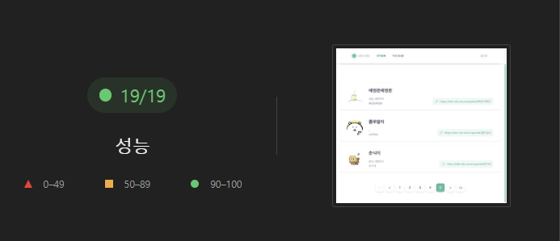

---

### 📌 실제 웹 페이지를 탐색하는 동안 지표를 측정한다.

- 기간 모드 시작을 눌러 성능 측정을 원하는 작업을 수행하고 종료하면 지표를 확인할 수 있다.

### 탐색 모드에서 확인하지 못했던 지표가 존재한다.

- 흔적 : 웹 성능을 추적한 기간을 성능 탭에서 보여준다.

- 트리맵 : 페이지를 로딩할 때 함께 로딩한 모든 리소스를 함께 모아서 볼 수 있는 곳이다.

<br>

### 13.2.3 구글 라이트하우스 - 스냅샷

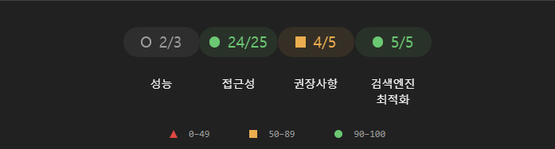

---

### 📌 현재 페이지의 상태에서 다양한 지표를 분석할 수 있다.

- 기본적으로 탐색 모드와 매우 유사하다.

<br>

## 13.3 WebPageTest

### ✨ 기본적으로 라이트하우스의 기준보다 훨씬 먼 서버를 테스트하는 용도이므로 글로벌 웹페이지를 만드는 것이 아니라면 지양하자.

<br>

### 13.3.1 Performance Summary

---

### 📌 성능 테스트는 크게 세가지 영역으로 나뉜다.

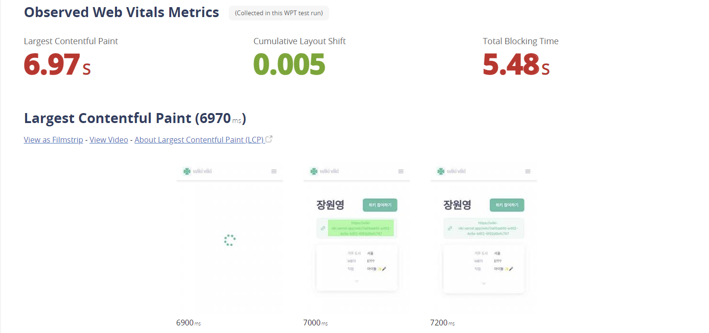

- Opportunities & Experiments

  - is it Quick : 웹 사이트가 충분히 빠른지 평가

  - is it Usable : 웹 사이트의 사용성과 시각적인 요소를 평가

  - is it Reslient : 웹 사이트의 보안 취약성을 평가

<br>

### 13.3.3 Filmstrip

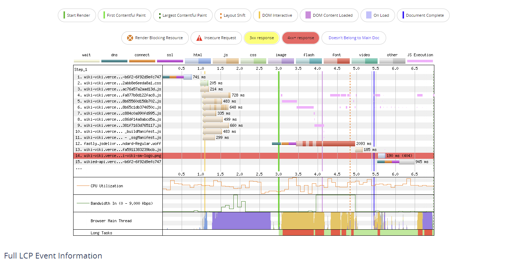

---

### 📌 웹 사이트를 필름을 보는 것과 같이 시간에 흐름에 따라 그려낸다.

- 그래프를 직접 확인하여 어떤 것이 성능에 영향을 끼치는지, 개선점은 무엇인지 확인할 수 있다.

<br>

### 13.3.4~5 Details & Web Vitals

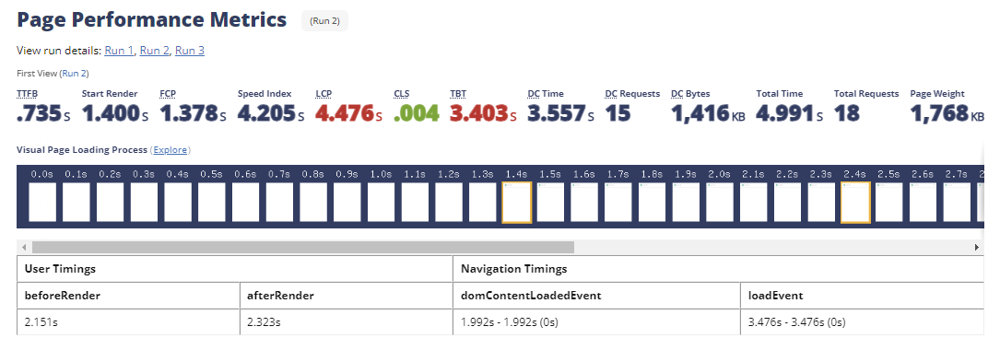

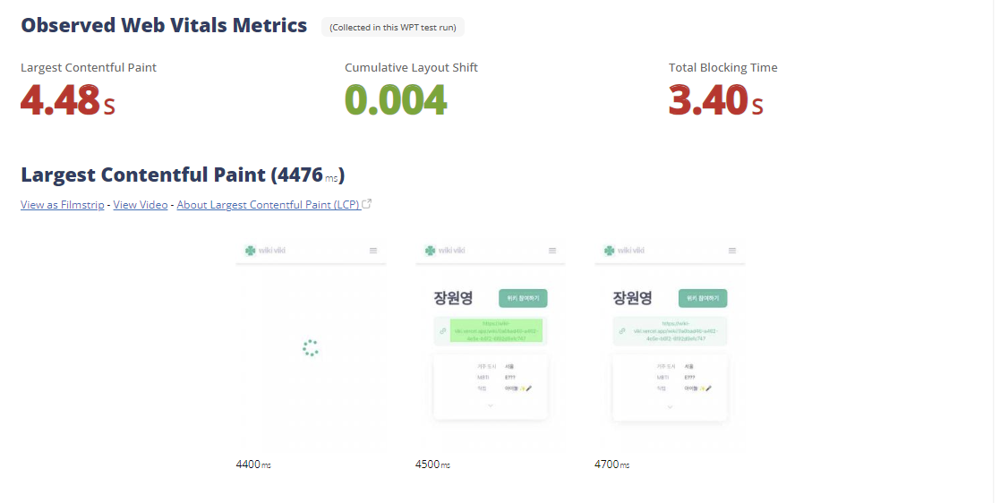

---

### 📌 Details는 Filmstrip에서 보여준 내용을 자세하게 보여주며, Web Vitals 에선 웹 성능 지표의 자세한 내용을 확인 가능하다.

<br>

### 13.3.6 Optimizations

---

### 📌 최적화와 관련된 메뉴들로, 리소스들이 얼마나 최적화 되어있는지 나타낸다.

- 해당 탭에선 서버와의 연결 유지, 리소스 및 이미지 압축 여부, JPEG 이미지 렌더링 여부, 리소스 캐시 정책 및 CDN 거침 여부를 확인할 수 있다.

<br>

### 13.3.7 Content

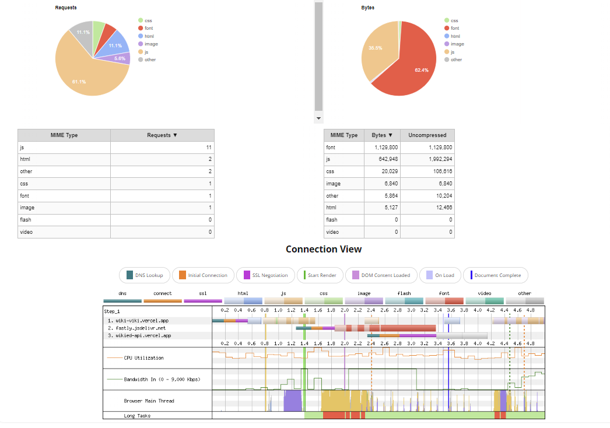

---

### 📌 웹 사이트에서 제공하는 콘텐츠, 에셋을 종류별로 묶어 통계를 보여준다.

<br>

### 13.3.8 Domains

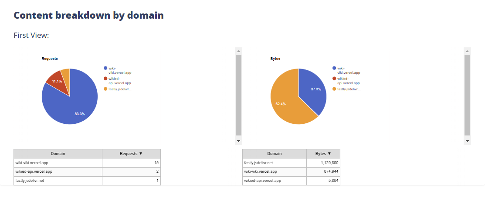

---

### 📌 Content 메뉴에서 보여준 에셋들이 어느 도메인에서 왔는지 도메인별로 확인할 수 있다.

<br>

### 13.3.9 Console log

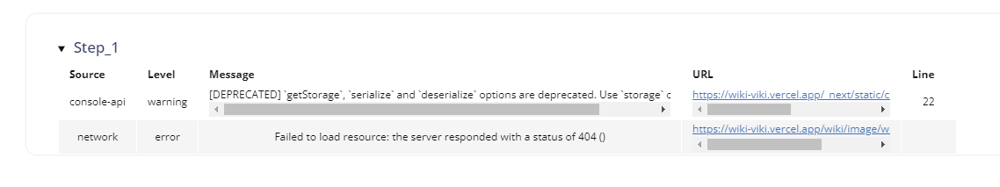

---

### 📌 사용자가 웹페이지에 접속했을 때 console.log로 무엇이 기록됐는지 확인할 수 있다.

<br>

### 13.3.10 Detected Technologies

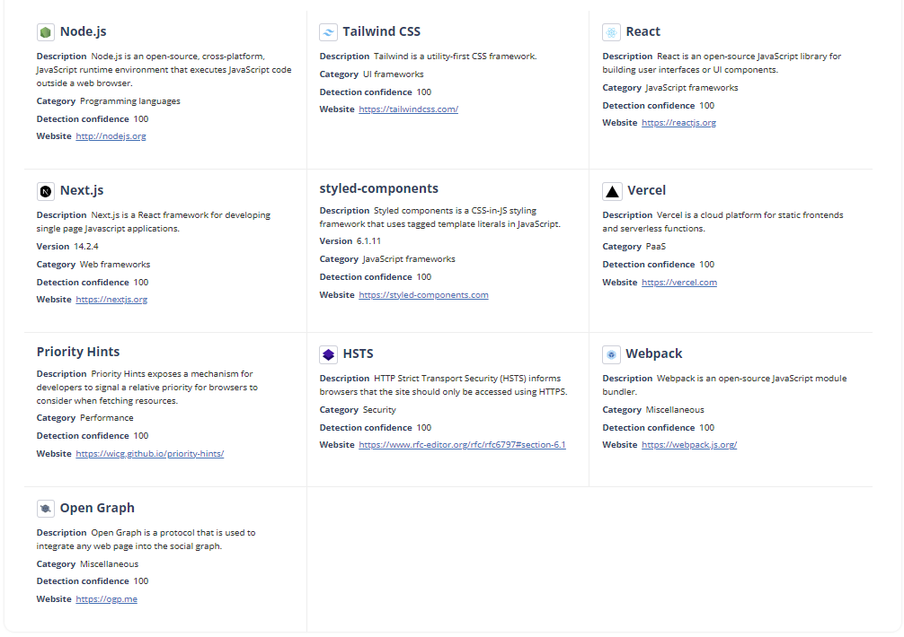

---

### 📌 웹 사이트 개발에 사용된 기술을 확인할 수 있다.

<br>

### 13.3.11 Main-Thread Processing

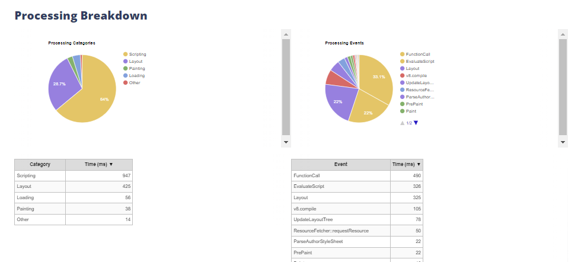

---

### 📌 메인 스레드가 어떤 작업을 처리했는지 확인할 수 있다.

<br>

### 13.3.12~13 Lighthouse Report & etc..

---

### 📌 구글 라이트하우스 리포트를 확인하거나 외부 제공 서비스들을 이용할 수 있다.

- Image Analysis, Request Map, Data Cost, Security Score 등

<br>

## 13.4 크롬 개발자 도구

### ✨ 웹 사이트의 성능 이슈를 확인하기 위해 더 세세하게 크롬 개발자 도구를 활용해보자

<br>

### 13.4.1 성능 통계

---

### 📌 Performance Insight 기능을 이용해 웹 사이트의 성능을 자세하게 확인할 수 있다.

<br>

### 13.5 정리

---

- 웹 사이트 성능 개선에 항상 책임감을 가지고 연구해보아야 한다.

- 단순히 리액트 개발자가 아닌 궁극적으로 웹 애플리케이션 개발자가 되는 것을 추구해야한다.
