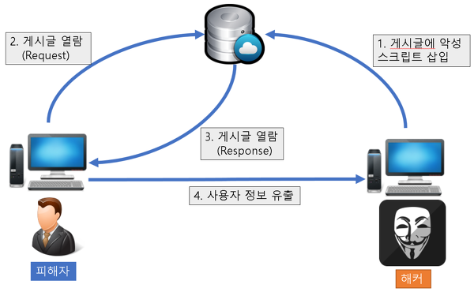
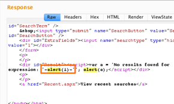

# 17회차

# 14장

성능만큼이나 중요한 웹사이트의 보안을 살펴보자.

## 리액트에서 발생하는 크로스 사이트 스크립팅(XSS)

웹 앱에서 가장 많이 보이는 취약점.  
개발자가 아닌 제3자가 악성 스크립트를 삽입해 실행하는 것.



```JS
<p>글작성</p>
<script>
  alert('XSS')
</script>
```

저 글을 방문하면 스크립트도 실행되버려서 나쁜짓을 저지를 수 있음.  
XSS 이슈가 어떻게 발생하는지 알아보자.

### dangerouslySetlnnerHTML prop

특정 브라우저 DOM의 innerHTML을 특정한 내용으로 교체해줌.

```JS
const html = `<span><svg/onload=alert(origin)></span>`

function App() {
  return <div dangerouslySetInnerHTML={{ __html: html }} />
}
```

html 키를 가진 객체만 인수로 받고, 문자열을 DOM에 그대로 표시함.  
=> origin 내용이 alert로 뜸. 문자열에 제한이 없어서 이상한 문구를 넣을수도 있음.

### useRef를 활용한 직접 삽입

dangerouslySetInnerHTML과 비슷한 방법. 직접 DOM에 접근해버림.

```jS
const html = `<span><svg/onload=alert(origin)></span>`
// <a> 태그에 잘못된 href삽입하거나 이벤트 활용등 도 할 수 있음.

function App() {
  const divRef = useRef<HTMLDivElement>(null)

  useEffect(() => {
    if (divRef.current) {
      divRef.current.innerHTML = html
    }
  })

  return <div ref={duvRef} >
}
```

origin이 alert로 뜸.

### 리액트에서 XSS 문제를 피하는 방법

제3자가 삽입할 수 있는 HTML을 안전한 HTML 코드로 한 번 치환하는 것. (sanitize or escape)  
대표적인 3가지의 npm 라이브러리 사용해서 보안해보자.

- DOMpurity
- sanitize-html
- js-xss

이 중 sanitize-html을 알아보자.

```js
const sanitizeHtml = require("sanitize-html");

const dirtyHtml =
  "<a href=\"javascript:alert('XSS')\">클릭하세요</a><div>안전한 내용</div>";
const cleanHtml = sanitizeHtml(dirtyHtml, {
  allowedTags: ["a", "div"],
  allowedAttributes: {
    a: ["href"],
  },
  allowedSchemes: ["http", "https"],
});
// 위의 태그들은 허용해주는 방식

console.log(cleanHtml);
```



이러한 이스케이프 과정을 보여줄 때 뿐만아니라 사용자가 저장할 떄도 거쳐주자.  
"클라이언트에서 사용자가 입력한 데이터는 일단 의심한다"라는 자세로 서버에서 치환 과정을 수행하자.

## getServerSideProps와 서버 컴포넌트를 주의하자

서버에는 보안에 중요한 정보가 있기 떄문에 브라우저에 정보를 줄 때는 조심하자.

```Js
export const getServerSideProps = async (ctx: GetServerSidePropsContext) => {
  const cookie = ctx.req.headers.cookie || ''
  return {
    props: {
      cookies,
    },
  }
}
// 쿠키자체를 내려주지말고 필요한 정보만 내려줘서 보안과 성능 둘다 챙기자.

=>

export const getServerSideProps = async (ctx:GetServerSidePropsContext) => {
  const cookie = ctx.req.headers.cookie || ''

  const token = validateCookie(cookie)

  return {
    props: {
      token // 꼭 필요한 토큰만 내려줌.
    }
  }
}
// 리다이렉트 같은 것도 여기서 수행하자 클라이언트에서 하면 성능 구짐.
```

## `<a>` 태그의 값에 적절한 제한을 둬야 한다

`<a>` 태그의 href에 javascript: 넣어주면 기본 기능을 막아버림.  
=> onClick 같은 이벤트 핸들러의 동작을 수행해야 할 때 씀.

```js
function App() {
  return (
    <a> href="javascript:;" onClick={()=> {console.log("hi")}}
  )
}
// 페이지 이동이 안일어나고 onClick 동작 수행
```

별로 좋진 않으니 button태그로 커버하자.

## HTTP 보안 헤더 설정하기

보안 취약점을 미연에 방지하기 위해 브라우저와 함께 작동하는 헤더  
=> 매우 기초적인 부분임. 기초가 중요하다!

### Strict-Transport-Security

```js
Strict-Transport-Security: max-age=<expire-time>; includeSubDomains
// expire-time을 설정해서 브라우저가 기억하는 시간을 정해주자. 자동으로 HTTPS로 요청함.
// => 시간 경과하면 HTTPS로 로드 => 응답에 따라 HTTPS로 이동.
```

모든 사이트가 HTTPS를 통해 접근해야함.  
뭐 includeSubDomains가 있으면 하위 도메인에도 적용된다함.

### X-XSS-Protection

비표준 기술. 사파리와 구형 브라우저에서만 제공됨.
XSS 취약점이 발견되면 페이지 로딩을 중단해버림.

### X-Frame-Options

페이지를 frame, iframe, embed, object 내부에서 렌더링을 허용할지를 나타냄.  
=> 네이버 낚시 페이지 거르는 용도로 씀.

```JS
export default function App() {4
  return (
    <div>
      <iframe src="naver.com">
    </div>
  )
}
```

### Permissions-Policy

웹사이트에서 사용할 수 있는 기능, 사용할 수 없는 기능을 선언해버림.  
=> 카메라, GPS기능을 사용 못하게 막아서 해커의 나쁜 짓 방지.

### X-Content-Type-Options

MIME 유형이 브라우저에 의해 맘대로 변경되지 않게 막아줌.  
=> 해커가 .jpg 파일을 업로드한 경우(위장임 악성파일), 분석해서 .jpg가 찐인지 감별하고 컷해줌.

### Referrer-Policy

현재 요청을 보낸 페이지의 주소임.  
=> 찐주소인지 가짜 주소인지 판별해줌.

### Content-Security-Policy

콘텐츠 보안 정책. 다양한 지시문으로 보안을 강화해보자.

### 보안 헤더 설정하기

#### Next.js

Next.js에서는 앱 보안을 위해 HTTP 경로별로 보안 헤더를 적용할 수 있음.

```js
const securityHeaders = [
  {
    key: "key",
    value: "value",
  },
];

module.exports = {
  async headers() {
    return [
      {
        source: "/:path*", // 모든 경로
        headers: securityHeaders,
      },
    ];
  },
};
```

### 보안 헤더 확인하기

https://securityheaders.com/ 들어가면 원하는 사이트의 보안 헤더의 성능을 확인 가능.  
=> 쌉고트 함 프로젝트에 써보자.

## 취약점이 있는 패키지의 사용을 피하자

https://security.snyk.io/를 방문해 사용하는 패키지중에 취약한게 있다면 보완하자.

## OWASP Top 10

웹 앱 보안 프로젝트.  
웹의 정보 노출, 악성 스크립트, 보안 취약점 등을 연구하고, 주기적으로 10대 웹 앱 취약점을 공개한다.

## 정리

완벽한 소프트웨어는 없음.  
서비스를 유지보수하고, 사용자들의 목소리에 귀기울여 피드백들을 반영하는게 중요함.
