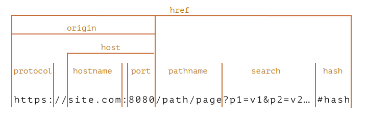

# 14장 웹사이트 보안을 위한 리액트와 웹페이지 보안 이슈

## 14.1 리액트에서 발생하는 크로스 사이트 스크립팅 (XSS)

XSS : Cross-Site Scripting

- 웹사이트 개발자가 아닌 웹사이트에 악성 스크립트를 삽입해 실행할 수 있는 취약점
- 사용자가 입력할 수 있고 이 입력을 다른 사용자에게 보여줄 수 있는 경우 발생
- 사용자가 프론트엔드 개발자처럼 script도 실행될 수 있으면 쿠키를 획득해 사용자 정보(토큰)를 탈취할 수 있음

❓리액트에서의 XSS 이슈는 어떻게 발생하나?

### 14.1.1 dangerouslySetInnerHTML prop

`dangerouslySetInnerHTML`

- 브라우저 DOM에서 innerHTML을 사용하기 위한 React의 대체 방법
- 사용자가 입력한 내용을 브라우저에 표시하는 용도로 사용
- \_ \_html 을 키로 가지고 있는 객체만 인수로 받음
- 이 인수로 넘긴 문자열을 DOM에 그대로 표시

```jsx
function MyComponent() {
  // <div>First Second</div>
  return <div dangerouslySetInnerHTML={{ __html: "First &middot; Second" }} />;
}
```

- 인수로 받는 문자열에 제한이 없기에 악성 스크립트를 삽입하는 등 보안 문제 발생할 수 있음

### 14.1.2 useRef를 활용한 직접 삽입

- useRef를 통해 직접 DOM에 직접 접근하여 innerHTML에 악성 스크립트를 삽입하면 동일한 문제 발생

### 14.1.3 리액트에서 XSS 문제를 피하는 방법

- `sanitize`, `escape`: 제3자가 삽입할 수 있는 HTML을 안전한 HTML 코드로 한 번 치환
- 관련 라이브러리 활용
- sanitize-html는 혀용할 태그와 목록을 일일히 나열하는 허용 목록 방식
- 서버에서 클라이언트 POST 요청에 있는 HTML 을 이스케이프하는 것이 가장 안전함

✨DOMPurify 라이브러리

- XSS 공격에 위험이 될만한 것들을 제거하여 innerHTML 방식을 사용할 수 있게 도와줌

```jsx
import React from "react";
import dompurify from "dompurify";

function Ex() {
  const sanitizer = dompurify.sanitize;
  return (
    <div
      dangerouslySetInnerHTML={{
        __html: sanitizer('<h1 style="color: red">예제</h1>'),
      }}
    ></div>
  );
}

export default Ex;
```

[Next.js DOMPurify로 XSS 공격 막기](https://velog.io/@brgndy/Next.js-DOMPurify%EB%A1%9C-XSS-%EA%B3%B5%EA%B2%A9-%EB%A7%89%EA%B8%B0)

- 게시판 외에도 쿼리스트링에 있는 내용을 그대로 실행하거나 보여주는 경우에도 보안 취약점 발생 가능
- 개발자가 작성한 코드가 아닌 사용자 입력한 데이터를 위험한 코드로 간주하고 처리해 주어야 함

✅ 리액트의 JSX 데이터 바인딩

- 리액트에서 기본적으로 이스케이프 작업을 함
- 그러나 dangerouslySetInnerHTML이나 props로 넘겨받는 경우 개발자 활용에따라 원본이 필요할 수 있기에 이런 작업이 수행 안 됨

## 14.2 **getServerSideProps와 서버 컴포넌트를 주의하자**

- 서버에는 일반 사용자에게 노출되면 안 되는 정보들이 담겨 있기 때문에 브라우저에 정보를 내려줄 때 유의해야 함
- getServerSideProps가 반환하는 props는 사용자의 HTML 에 기록되기 때문에 보안 위협에 노출될 수 있음
- 보안 + 성능 측면에서 서버 컴포넌트가 클라이언트 컴포넌트에 반환하는 props는 반드시 필요한 값으로만 제한되어야 함

## 14.3 <a> 태그의 값에 적절한 제한을 둬야 한다.

- `<a href="javascript:;">`
- a 태그의 기본 기능인 페이지 이동을 막고 이벤트 핸들러만 작동시키기 위해 사용
- 마크업 관접에서 안티 패턴
- 또한 href 에 사용자가 입력한 주소를 넣을 수 있으면 보안 이슈로 이어질 수 있음

## 14.4 HTTP 보안 헤더 설정하기

HTTP 보안 헤더

- 브라우저가 렌더링하는 내용과 관련된 보안 취약점을 미연에 방지하기 위해 브라우저와 함께 작동하는 헤더

### 14.4.1 **Strict-Transport-Securit**

- 모든 사이트가 HTTPS를 통해 접근해야 함
- HTTP로 접근하면 HTTPS로 변경하게 됨

### 14.4.2 **X-XSS-Protection**

- 페이지에서 XSS 취약점이 발견되면 페이지 로딩 중단

### 14.4.3 **X-Frame-Options**

- 페이지를 frame, iframe, embed, object 내부에서 렌더링을 허용할지를 나타낼 수 있음
- 외부에서 자신의 페이지를 위와 같은 방식으로 삽입되는 것을 막아주는 헤더 (쉽게 말해서 내가 만든 페이지를 남의 페이지에서 사용될 수 있게 할 것이냐)
- 클릭재킹 : 링크를 눌렀을 때 의도했던 것과 다른 동작을 한다.
- 웹페이지에서 iframe 태그를 숨겨놓고 실제 페이지의 클릭을 iframe내의 클릭으로 인식되게끔 자바스크립트 코드를 작성

```
X-Frame-Options: DENY
X-Frame-Options: SAMEORIGIN
```

- `DENY` : 무조건 막음
- `SAMEORIGIN` : 같은 origin에 대해서만 프레임 허용

### 14.4.4 **Permissions-Policy**

- 웹사이트에서 사용할 수 있는 기능과 사용할 수 없는 기능을 명시적으로 선언하는 헤더
- 브라우저의 기능에는 카메라 GPS 등이 있는데 이와 관련된 코드를 작성하지 않았다고 해도 XSS 공격으로 인해 사용자 정보를 획득할 수 있음
- 이를 막아서 XXS 가 발생해도 악영향 제한

### 14.4.5 **X-Content-Type-Options**

- MIME (Multipurpose Internet Mail Extensions)
  - Content-type 값으로 사용됨
- 브라우저는 Content-type를 참고하여 HTML 파싱
- X-Content-Type-Options은 MIME이 유형이 브라우저에 의해 임의로 변경되지 않게 하는 헤더
- 웹 서버가 브라우저에 강제로 이 파일을 읽는 방식을 지정

```
X-Content-Type-Options: nosniff
```

- 지정한 파일 타입이 CSS나 MIME이 text/css가 아닌 경우, 혹은 파일 내용이 script나 MIME 타입이 자바스크립트 타입이 아니면 차단

### 14.4.**6 Referrer-Policy**

- Referer 헤더에서 사용할 수 있는 데이터를 나타냄
  - HTTP 요청의 Referer 헤더 : 현재 요청을 보낸 페이지의 주소
- 출처(origin) : schema + hostname + port의 조합
  
  - 예시 https://yceffort.kr
  - `scheme`: HTTPS 프로토콜을 의미
  - `hostname`: `yceffort.kr`이라는 호스트명을 의미
  - `port`: 443 포트를 의미(HTTPS의 기본 포트 443)
  - cross origin은 origin 구성 요소 중 하나라도 다른 경우에 발생함
- Referrer-Policy는 응답 헤더 뿐만 아니라 meta 로도 설정 가능

```html
<meta name="referrer" content="origin" />
```

- 페이지 이동 태그에도 가능

```html
<a href="http://yceffort.kr" referrerpolicy="origin">...</a>
```

### 14.4.7 Content-Security-Policy

- 콘텐츠 보안 정책(CSP, Content-Security-Policy)
  - XSS 공격이나 데이터 삽입 공격과 같은 보안 위협 막기 위해 설계

📍 **\*-src**

- src를 제어할 수 있는 지시문
  • `script-src`, `style-src`, `font-src`, `img-src` 등
- 선언된 소스에서만 가져올 수 있음
- default-src로 한 번에 처리 가능

**📍 form-action**

- 폼 양식으로 제출할 수 있는 URL 제한
- form-action 자체를 막는 것도 가능

### 14.4.8 보안 헤더 설정하기

📍**Next.js**

- HTTP 경로별로 보안 헤더 적용 가능
- next.config.js 파일에서 적용
- [참고 링크](https://shinsangeun.github.io/posts/nextjs/next-xss)

## 14.5 취약점이 있는 패키지의 사용을 피하자

- package-lock.json
  - package.json이 의존하는 또 다른 패키지 명시된 파일
  - 모든 의존성을 파악하기는 어려움
- 깃허브의 Dependabot 활용하여 발견한 취약점을 조치할 수 있음
- 핵심적인 라이브러리들의 버저닝과 패치 수정 등은 항상 살펴볼 것

## 14.6 OWASP Top 10

- OWASP(Open WroldWide Application Security Project)
- 오픈소스 웹 애플리케이션 보안 프로젝트
- 웹에서 발생할 수 있는 정보 노출, 악성 스크립트, 보안 취약점 연구하여 10대 웹 애플리케이션 취약점을 공개
