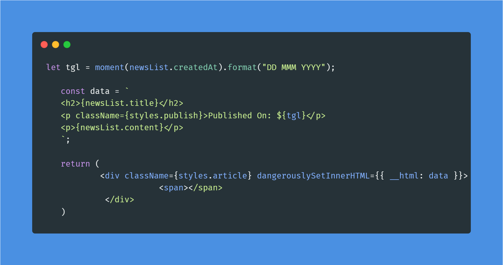

a# 웹 사이트 보안을 위한 리액트와 웹 페이지 보안 이슈

**리액트 기반 웹 앱에서 개발자가 신경써야 할 보안 이슈를 알아보자**!SECTION

<br>

## 14.1 리액트에서 발생하는 크로스 사이트 스크립팅(XSS)

### ✨ 제 3자가 웹 사이트가 악성 스크립트를 삽입해 실행하는 것

```js
<p>안녕? 난 해커야</p>
<script>
  alert('XSS')
</script>
```

### 별도의 조치가 없다면 위의 스크립트 또한 함께 실행될 것이다.

### 🫨 그 의미는 결국 개발자가 작성 가능한 모든 코드를 작성할 수 있다는 것이 된다.

<br>

### 14.1.1 dangerouslySetInnerHTML prop



---

### 📌 특정 브라우저 DOM의 innerHTML을 특정한 내용으로 교체하는 것

- 해당 메서드는 `__html` 키를 가진 객체만 인수로 받는데, 이 인수 문자열을 그대로 DOM에 표시한다.

- 주의할 점은 이 문자열에 제한이 없다는 것.

<br>

### 14.2.2 useRef를 활용한 직접 삽입

---

### 📌 dangerouslySetInnerHTML과 비슷하게 DOM에 직접 접근이 가능한 useRef를 이용해 공격하는 것

- 마찬가지로 스크립트를 직접적으로 작성하여 이를 `useRef` 훅을 통해 DOM에 넣어 공격한다.

<br>

### 14.1.3 리액트에서 XSS 문제를 피하는 방법

---

### 📌 가장 좋은 것은 제 3자가 삽입 가능한 HTML을 안전한 HTML로 한번 치환하는 것

- 이를 '새니타이즈', 혹은 '이스케이프' 라고 지칭한다.

- 직접 구현하는 것도 좋지만, 다양한 라이브러리가 존재한다.

  - `DOMpurify`, `sanitize-html`, `js-xss`

```js
import DOMPurify from "dompurify";
import { JSDOM } from "jsdom";

const sanitizeHtml = (html: string) => {
  return DOMPurify(new JSDOM("<!DOCTYPE html>").window).sanitize(html);
};

export default sanitizeHtml;
```

<br>

### ❗ 혹은 게시판과 같은 기능이 없더라도 쿼리스트링의 내용을 그대로 실행하는 등의 보안 취약점 또한 발생할 수 있다.

- 따라서 자신이 개발한 코드 이외에도 `query`, `GET 파라미터`, 서버 저장 사용자 입력 데이터 등 모든 코드를 위험 코드로 간주하고 이를 처리해야한다.

<br>

## 14.2 getServerSideProps와 서버 컴포넌트를 주의하자

### ✨ 서버에는 일반 사용자에게 노출하면 안되는 정보들이 담겨있기 때문에 주의해야 한다.

```jsx
export default function App({ cookie }: { cookie: string }) {
  if (!validateCookie(cookie)) {
    Router.replace(/**...**/);
    return null;
  }
  /** do somtihing...**/
}

export const getServerSideProps = async (cfx: GetServerSidePropsContext) => {
  const cookie = ctx.req.headers.cookie || "";
  return {
    props: {
      cookie,
    },
  };
};
```

- 위 코드는 서버로부터 쿠키를 받아와 클라이언트 측에서 `validation` 까지 수행하는 코드다.

- 하지만 충분히 위험하고, 효율도 떨어진다.

```jsx
export default function App({ token }: { token: string }) {
  const user = JSON.parse(window.atob(token.split("."[1])));
  const user_id = user.id;

  /*...*/
}

export const getServerSideProps = async (
  ctx: GetServerSidePropsContext
): Promise<GetServerSidePropsResult<{ isValid: boolean }>> => {
  const cookie = ctx.req.headers.cookie || "";
  const token = validateCookie(cookie);

  if (!token) {
    return {
      redirect: {
        destination: "/login", // 유효하지 않은 경우 리다이렉트할 페이지
        permanent: false,
      },
    };
  }

  return {
    props: {
      token,
    },
  };
};
```

### 이런식으로 변경해볼 수 있겠지?

<br>

## 14.3 `<a>` 태그에 적절한 제한을 둬야 한다.

### ✨ `<a>` 태그의 href 속성에 적절한 값을 넣어 오용을 방지하자

```jsx
function App() {
  const handleClick = () => {
    console.log("hello");
  };

  return (
    <>
      <a href="javascript:;" onClick={handleClick}>
        링크
      </a>
    </>
  );
}
```

- 위 코드는 a 태그의 `href` 속성을 막고 `onClick` 이벤트로 대신했다.

- 사용자가 `href` 에 특정 주소를 넣을 수 있다면 보안 이슈로 발전할 수 있어 이를 방지해야 한다.

```jsx
function isSafeHref(href: string) {
  let isSafe = false
  try {
    const url = new URL(href)
    if(['http:', 'https:']).includes(url.protocol) {
      isSafe = true
    }
  } catch {
    isSafe = false
  }

  return isSafe
}

function App () {
  const unSafeHref = 'javascript:alert('hello');'
  const safeHref = 'http://www.naver.com/'

  return (
    <>
      <a href={isSafeHref(unSafeHref) ? unSafeHref : '#'}>위험한 주소</a>
      <a herf={isSafeHref(safeHref) ? safeHref : '#'}>안전한 주소</a>
    </>
  )
}
```

<br>

## 14.4 HTTP 보안 헤더 설정하기

### ✨ 보안 취약점 방지를 위해 브라우저와 함께 작동하는 헤더

<br>

### 14.4.1 Strict-Transport-Security

---

### 📌 모든 사이트가 HTTPS를 통해 접근해야 하며 아니라면 변경시켜준다

```js
Strict-Transport-Security: max-age=<expire-time>; includeSubDomains
```

- `<expire-time>` 은 브라우저가 기억해야하는 시간을 의미한다.

- 이 시간동안 브라우저는 자동으로 HTTPS로 요청하며, 경과하면 HTTP로 로드를 시도하고 응답에 따라 변경한다.

- 권장값은 2년이다. (일반적으로는 1년 설정)

<br>

### 14.4.2 X-XSS-Protection

---

### 📌 비 표준 기술로서 사파리와 구형 브라우저에서만 제공

- XSS 취약점이 발견될 시에 페이지 로딩을 중단

- 전적으로 믿어서는 안되며, 항상 적절한 처리를 해주어야 한다.

<br>

### 14.4.3 X-Frame-Options

---

### 📌 frame, iframe, embed, object 내부에서 렌더링을 허용할지 여부 결정

- 예를 들어 iframe으로 내부를 꽉 채워 네이버를 렌더링하면 사용자가 실제 네이버로 오인할 수 있고, 이를 활용해 공격자가 정보를 탈취할 수 있다.

```jsx
export default function App () {
  return (
    <div>
      <iframe src="https://www.naver.com">
    </div>
  )
}
```

- 해당 코드는 제대로 실행되지 않는데, 네이버에 자체적으로 `X-Frame-Options: deny` 옵션이 있기 때문이다.

<br>

### 14.4.4 Permissions-Policy

---

### 📌 웹 사이트에서 사용 가능한 기능과 사용 불가한 기능을 명시적으로 선언하는 헤더

```js
Permissions-Policy: camera=(), microphone=(), geolocation=()
```

- 브라우저가 제공하는 기능을 선언적으로 차단하여 XSS가 발생해도 사용자에게 악영향을 끼치지 않도록 만든다.

<br>

### 14.4.5 X-Content-Type-Options

---

### 📌 Content-Type에서 대표적으로 사용되는 인코딩 방식

- MIME(Multipurpose Internet Mail Extensions) 유형이 임의로 브라우저에 의해 변경되지 않도록 변경

- 예시로 `.jpg` 파일에 진짜 그림이 아닌 악성 코드를 심어 올리는 경우, 해당 헤더에 의해 text/css 가 아닌 경우 차단된다.

<br>

### 14.4.6 Referrer-Policy

---

### 📌 사용자가 어디서 와서 방문 중인지 인식할 수 있는 헤더

- 하지만 사용자 관점에서 원치 않는 정보가 노출될 수 있는 헤더이다.

- 출처값 비교 정보를 바탕으로 작동한다.

```html
<meta name="referrer" content="origin" />
```

- `<meta>` 태그로도 사용 가능하며, 페이지 이동이나 이미지 요청, `<Link>` 태그에도 사용 가능하다.

<br>

### 14.4.7 Content-Security-Policy

---

### 📌 콘텐츠 보안 정책은 이러한 XSS 나 데이터 삽입 공격을 막기 위해 설계됐다.

- `*-src` : 다양한 `src` 를 제어할 수 있는 지시문

- 그 외에도 태그별 다양한 지시문이 존재한다.

<br>

### 14.4.8 보안 헤더 설정하기

---

### 📌 Next.js에서 설정 가능한 헤더

```js
// next.config.js

const securityHeaders = [
  {
    key: 'key',
    value: 'value',
  }
]

module.exports = {
  async headers() {
    return {
      {
        source: '/:path',
        headers: securityHeaders,
      }
    }
  }
}
```

### 📌 NGNIX에서 설정 가능한 헤더

- 정적 파일을 제공해 `add_header` 지시자를 사용해 ㅜ언하는 응답 헤더 추가 가능

### 가장 빠른 방법은 보안 헤더의 현황을 알려주는 [보안헤더 현황확인](https://securityHeaders.com/)를 방문하는 것

<br>

## 14.5 취약점이 있는 패키지의 사용을 피하자

### ✨ package.lock.json의 모든 의존성 파일을 파악하는 건 불가능에 가까우므로, [라이브러리 보안 취약점 확인](https://security.snyk.io)를 방문해 확인

<br>

## 14.6 OWASP Top 10

### ✨ 오픈소스 웹 앱 보안 프로젝트로, 주기적으로 10대 웹 앱 취약점을 공개한다.

- 간략하게 살펴보면 도움이 될 것이다.

<br>

## 14.7 정리

### 완벽한 소프트웨어는 없다.

- 항상 보안 이슈에 귀기울이며 이를 해결하는 것 또한 개발자의 중요한 의무 중 하나다.
